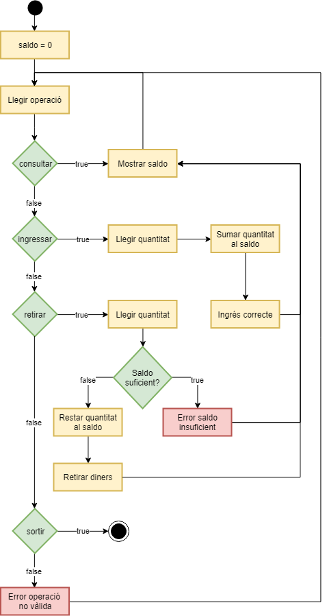

# Caixer automàtic

Es vol implementar un REPL per a interactuar amb un caixer automàtic.
Ha de permetre ingressar i retirar diners, i consultar el saldo.

El funcionament que ha de tenir es reflecteix en aquest Diagrama de fluxe:



## Input

El REPL va rebent operacions fins que rep la operació "SORTIR".

operacions = { CONSULTAR | INGRESSAR | RETIRAR | SORTIR }

Les operacions d'INGRESSAR i RETIRAR van antecedides de la QUANTITAT (nombre decimal).

No hi ha restriccions significatives

## Output

EL REPL anirà mostrant el resultat de les operacions. Els missatges de sortida han de tenir aquest format:

- Mostrar saldo: ">> Saldo: "

- Ingrés correcte: "Ingres realitzat: "

- Error saldo insuficient: "Saldo insuficient"

- Retirar diners: "Retirar diners -> "

- Error operació no vàlida: "Operacio no valida"

 i  s'han de mostrar amb dues xifres decimals.

## Tests

### Test
```input
INGRESSAR 10
RETIRAR 5
SORTIR
```
```output
Ingres realitzat: 10.00
>> Saldo: 10.00
Retirar diners -> 5.00
>> Saldo: 5.00
```

### Test
```input
INGRESSAR 10
RETIRAR 5
SORTIR
```
```output
Ingres realitzat: 10.00
>> Saldo: 10.00
Retirar diners -> 5.00
>> Saldo: 5.00
```

### Test
```input
INGRESSAR 10
RETIRAR 5
RETIRAR 5
SORTIR
```
```output
Ingres realitzat: 10.00
>> Saldo: 10.00
Retirar diners -> 5.00
>> Saldo: 5.00
Retirar diners -> 5.00
>> Saldo: 0.00
```

### Test
```input
INGRESSAR 10
RETIRAR 10
RETIRAR 5
SORTIR
```
```output
Ingres realitzat: 10.00
>> Saldo: 10.00
Retirar diners -> 10.00
>> Saldo: 0.00
Saldo insuficient
>> Saldo: 0.00
```

### Test
```input
INGRESSAR 10
RETIRAR 5
INGRESSAR 10
RETIRAR 15
RETIRAR 10
SORTIR
```
```output
Ingres realitzat: 10.00
>> Saldo: 10.00
Retirar diners -> 5.00
>> Saldo: 5.00
Ingres realitzat: 10.00
>> Saldo: 15.00
Retirar diners -> 15.00
>> Saldo: 0.00
Saldo insuficient
>> Saldo: 0.00
```

### Test
```input
INGRESSAR 10
RETIRAR 5
INGRESSAR 10
RETIRAR 20
RETIRAR 10
SORTIR
```
```output
Ingres realitzat: 10.00
>> Saldo: 10.00
Retirar diners -> 5.00
>> Saldo: 5.00
Ingres realitzat: 10.00
>> Saldo: 15.00
Saldo insuficient
>> Saldo: 15.00
Retirar diners -> 10.00
>> Saldo: 5.00
```

### Test
```input
INGRESSAR 10.5
INGRESSAR 10.5
CONSULTAR
RETIRAR 5.5
CONSULTAR
SORTIR
```
```output
Ingres realitzat: 10.50
>> Saldo: 10.50
Ingres realitzat: 10.50
>> Saldo: 21.00
>> Saldo: 21.00
Retirar diners -> 5.50
>> Saldo: 15.50
>> Saldo: 15.50
```

### Test
```input
INGRESSAR 10
PAGAR
RETIRAR 5
CONSULTAR
SORTIR
```
```output
Ingres realitzat: 10.00
>> Saldo: 10.00
Operacio no valida
Retirar diners -> 5.00
>> Saldo: 5.00
>> Saldo: 5.00
```

### Test
```input
INGRESSAR 10
TRANSF
TRANSFER
CONSULTAR
SORTIR
```
```output
Ingres realitzat: 10.00
>> Saldo: 10.00
Operacio no valida
Operacio no valida
>> Saldo: 10.00
```
