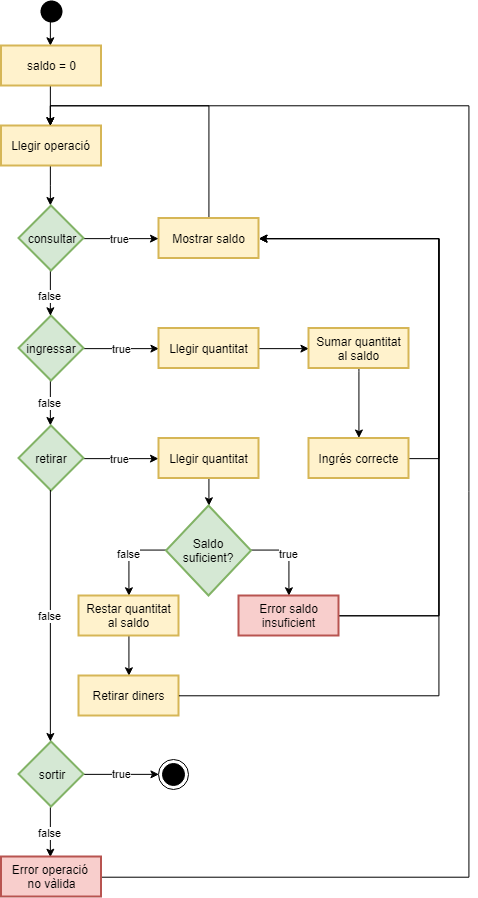

# Caixer automàtic

Es vol implementar un REPL per a interactuar amb un caixer automàtic.
Ha de permetre ingressar i retirar diners, i consultar el saldo.

El funcionament que ha de tenir es reflecteix en aquest Diagrama de fluxe:

## Input

El REPL va rebent operacions fins que rep la operació "SORTIR".

operacions = { CONSULTAR | INGRESSAR | RETIRAR | SORTIR }

Les operacions d'INGRESSAR i RETIRAR van antecedides de la QUANTITAT (nombre decimal).

No hi ha restriccions significatives

## Output

EL REPL anirà mostrant el resultat de les operacions. Els missatges de sortida han de tenir aquest format:

- Mostrar saldo: ">> Saldo: "

- Ingrés correcte: "Ingres realitzat: "

- Error saldo insuficient: "Saldo insuficient"

- Retirar diners: "Retirar diners -> "

- Error operació no vàlida: "Operacio no valida"

 i  s'han de mostrar amb dues xifres decimals.
