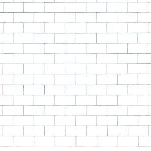

# Another brick in the wall

L'any 1978, el mític grup Pink Floyd va publicar el seu 11è disc: The Wall.
A les seves actuacions, Pink FLoyd, sempre utilitzaven efectes visuals per acompanyar la seva psicodèlica música rock. Per al tour de The Wall, un enorme mur es construïa a l'escenari entre la banda i el públic.



En aquesta ocasió la banda ens demana una aplicació que generi un mur ASCII-ART per a projectar a l'escenari.

## Input

L'entrada consisteix en 4 nombres: amplada del maó, alçada del maó, nombre de maons per línia, nombre de línies de maons.

## Output

S'imprimirà un mur de les dimensions especificades.
El mur ha de començar amb un maó complet.

Exemple de mur 8-1-3-3:

```
----------------------------
|        |        |        |
----------------------------
    |        |        |
----------------------------
|        |        |        |
----------------------------
```

## Tests

### Test
```input
8 1 3 3
```
```output
----------------------------
|        |        |        |
----------------------------
    |        |        |
----------------------------
|        |        |        |
----------------------------
```

### Test
```input
8 1 4 3
```
```output
-------------------------------------
|        |        |        |        |
-------------------------------------
    |        |        |        |
-------------------------------------
|        |        |        |        |
-------------------------------------
```

### Test
```input
6 1 5 4
```
```output
------------------------------------
|      |      |      |      |      |
------------------------------------
   |      |      |      |      |
------------------------------------
|      |      |      |      |      |
------------------------------------
   |      |      |      |      |
------------------------------------
```

### Test
```input
6 2 4 3
```
```output
-----------------------------
|      |      |      |      |
|      |      |      |      |
-----------------------------
   |      |      |      |
   |      |      |      |
-----------------------------
|      |      |      |      |
|      |      |      |      |
-----------------------------
```

### Test
```input
6 3 4 2
```
```output
-----------------------------
|      |      |      |      |
|      |      |      |      |
|      |      |      |      |
-----------------------------
   |      |      |      |
   |      |      |      |
   |      |      |      |
-----------------------------
```

### Test private
```input
8 1 6 10
```
```output
-------------------------------------------------------
|        |        |        |        |        |        |
-------------------------------------------------------
    |        |        |        |        |        |
-------------------------------------------------------
|        |        |        |        |        |        |
-------------------------------------------------------
    |        |        |        |        |        |
-------------------------------------------------------
|        |        |        |        |        |        |
-------------------------------------------------------
    |        |        |        |        |        |
-------------------------------------------------------
|        |        |        |        |        |        |
-------------------------------------------------------
    |        |        |        |        |        |
-------------------------------------------------------
|        |        |        |        |        |        |
-------------------------------------------------------
    |        |        |        |        |        |
-------------------------------------------------------
```
