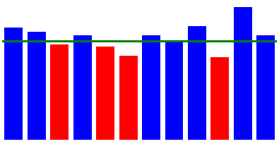

# Mitjana de vendes



Ens demanen un programa per a generar els gràfics de la **mitjana mensual** de vendes d'una empresa, a partir de les dades de vendes de cada dia de l'any.

El gràfic ha de mostrar també la **mitjana anual per mesos** i marcar quins mesos estàn per sota d'aquesta mitjana.

## Input

L'entrada consta del volum de vendes de cada dia de l'any (comptant amb que febrer té sempre 28 dies) en format CSV.

## Output

S'imprimirà el codi HTML que genera el gràfic de vendes mensual:

```text

```

La propietat  de cada DIV correspon a la mitjana mensual de vendes del mes corresponent.

El color de fons de cada DIV es  si la mitjana d'aquell mes està per sota de la mitjana anual, i  si és igual o superior.

La propietat  de l'últim DIV correspon a la mitjana anual per mesos.

## Tests

### Test
```input
36, 1, 125, 181, 189, 2, 169, 130, 124, 126, 41, 66, 220, 34, 87, 157, 52, 99, 65, 24, 203, 98, 96, 98, 167, 159, 157, 115, 88, 11, 64
127, 9, 133, 96, 62, 59, 0, 138, 136, 186, 94, 100, 84, 137, 10, 18, 30, 9, 103, 42, 106, 102, 85, 220, 38, 87, 65, 60
76, 31, 36, 57, 16, 11, 105, 56, 3, 70, 88, 1, 6, 106, 35, 114, 1, 8, 23, 28, 105, 49, 109, 86, 126, 49, 13, 0, 104, 170, 150
125, 52, 107, 139, 11, 6, 109, 123, 119, 53, 52, 26, 94, 35, 18, 77, 51, 42, 93, 5, 62, 67, 31, 138, 117, 1, 135, 93, 21, 104
74, 48, 137, 62, 141, 56, 238, 35, 89, 25, 56, 1, 123, 168, 209, 79, 29, 148, 79, 24, 7, 48, 29, 21, 77, 74, 94, 142, 127, 130, 153
87, 86, 52, 20, 100, 85, 98, 184, 179, 2, 207, 139, 78, 52, 83, 83, 136, 75, 35, 106, 29, 61, 107, 38, 81, 194, 26, 69, 76, 0
3, 39, 74, 121, 0, 9, 107, 168, 73, 86, 61, 111, 33, 41, 36, 119, 74, 113, 191, 199, 61, 23, 88, 80, 68, 22, 130, 159, 74, 79, 51
96, 54, 103, 31, 59, 46, 129, 71, 93, 138, 92, 63, 60, 140, 39, 175, 146, 63, 1, 71, 85, 4, 16, 109, 94, 27, 105, 73, 121, 113, 34
83, 201, 166, 185, 46, 61, 51, 35, 42, 246, 51, 34, 27, 46, 12, 28, 112, 131, 101, 112, 148, 54, 9, 0, 98, 66, 126, 20, 148, 152
33, 161, 176, 97, 20, 3, 169, 7, 44, 43, 50, 80, 91, 32, 64, 93, 80, 52, 11, 129, 100, 43, 100, 124, 125, 131, 3, 145, 99, 12, 27
167, 11, 6, 25, 72, 171, 24, 60, 85, 65, 167, 78, 27, 102, 127, 138, 78, 68, 63, 30, 95, 34, 26, 98, 20, 96, 91, 122, 107, 40
59, 178, 48, 12, 39, 71, 220, 191, 111, 69, 78, 74, 196, 22, 43, 1, 139, 4, 84, 58, 106, 123, 16, 69, 33, 101, 99, 250, 89, 122, 100
```
```output
<!DOCTYPE html>
<div style="display: flex; align-items: baseline;">
    <div style="width: 16px; margin: 2px; background-color: blue; height: 102px;"></div>
    <div style="width: 16px; margin: 2px; background-color: blue; height: 83px;"></div>
    <div style="width: 16px; margin: 2px; background-color: red; height: 59px;"></div>
    <div style="width: 16px; margin: 2px; background-color: red; height: 70px;"></div>
    <div style="width: 16px; margin: 2px; background-color: blue; height: 87px;"></div>
    <div style="width: 16px; margin: 2px; background-color: blue; height: 85px;"></div>
    <div style="width: 16px; margin: 2px; background-color: red; height: 80px;"></div>
    <div style="width: 16px; margin: 2px; background-color: red; height: 79px;"></div>
    <div style="width: 16px; margin: 2px; background-color: blue; height: 86px;"></div>
    <div style="width: 16px; margin: 2px; background-color: red; height: 75px;"></div>
    <div style="width: 16px; margin: 2px; background-color: red; height: 76px;"></div>
    <div style="width: 16px; margin: 2px; background-color: blue; height: 90px;"></div>
    <div style="background-color: green; height: 2px; width: 240px; position: relative; bottom: 81px; right: 240px"></div>
</div>
```

### Test
```input
160, 58, 32, 87, 52, 65, 25, 121, 35, 88, 6, 147, 103, 196, 78, 43, 180, 107, 84, 122, 126, 236, 103, 188, 70, 89, 82, 96, 118, 84, 164
235, 119, 160, 89, 149, 21, 16, 15, 137, 127, 141, 71, 110, 12, 120, 72, 17, 109, 124, 157, 108, 75, 12, 125, 144, 110, 159, 84
67, 13, 79, 60, 19, 73, 146, 124, 51, 88, 36, 103, 51, 149, 61, 21, 21, 13, 30, 51, 6, 49, 97, 89, 12, 95, 50, 130, 129, 2, 77
151, 105, 114, 32, 123, 18, 12, 157, 10, 45, 20, 68, 62, 134, 97, 98, 45, 95, 106, 50, 56, 50, 58, 89, 60, 70, 125, 2, 40, 54
4, 106, 32, 89, 11, 28, 14, 93, 2, 0, 125, 69, 15, 98, 94, 166, 96, 63, 45, 43, 7, 65, 112, 192, 3, 120, 155, 126, 238, 18, 71
174, 48, 64, 36, 56, 138, 81, 82, 32, 117, 131, 19, 177, 33, 79, 54, 139, 86, 53, 172, 97, 71, 113, 77, 199, 3, 183, 160, 27, 164
130, 168, 50, 111, 112, 55, 14, 113, 94, 59, 126, 53, 12, 84, 50, 7, 20, 127, 32, 45, 37, 16, 64, 50, 42, 94, 27, 86, 92, 66, 117
94, 59, 114, 6, 62, 125, 21, 12, 0, 87, 125, 43, 132, 13, 31, 59, 19, 107, 26, 70, 64, 85, 103, 113, 67, 191, 130, 85, 151, 6, 3
99, 73, 8, 100, 39, 217, 161, 160, 40, 240, 85, 162, 197, 106, 96, 17, 99, 134, 102, 168, 184, 147, 116, 6, 216, 6, 63, 168, 91, 125
109, 131, 133, 0, 18, 25, 30, 108, 107, 93, 149, 99, 9, 16, 79, 46, 152, 36, 2, 10, 72, 25, 85, 17, 93, 87, 28, 96, 53, 79, 148
45, 13, 174, 64, 51, 139, 16, 166, 6, 5, 91, 215, 49, 95, 16, 44, 123, 90, 119, 12, 71, 36, 32, 52, 23, 183, 77, 56, 143, 74
156, 138, 24, 51, 0, 59, 61, 26, 95, 91, 259, 203, 68, 104, 121, 28, 15, 113, 94, 126, 37, 75, 92, 175, 78, 29, 86, 73, 0, 78, 34
```
```output
<!DOCTYPE html>
<div style="display: flex; align-items: baseline;">
    <div style="width: 16px; margin: 2px; background-color: blue; height: 101px;"></div>
    <div style="width: 16px; margin: 2px; background-color: blue; height: 100px;"></div>
    <div style="width: 16px; margin: 2px; background-color: red; height: 64px;"></div>
    <div style="width: 16px; margin: 2px; background-color: red; height: 71px;"></div>
    <div style="width: 16px; margin: 2px; background-color: red; height: 74px;"></div>
    <div style="width: 16px; margin: 2px; background-color: blue; height: 95px;"></div>
    <div style="width: 16px; margin: 2px; background-color: red; height: 69px;"></div>
    <div style="width: 16px; margin: 2px; background-color: red; height: 71px;"></div>
    <div style="width: 16px; margin: 2px; background-color: blue; height: 114px;"></div>
    <div style="width: 16px; margin: 2px; background-color: red; height: 68px;"></div>
    <div style="width: 16px; margin: 2px; background-color: red; height: 76px;"></div>
    <div style="width: 16px; margin: 2px; background-color: blue; height: 83px;"></div>
    <div style="background-color: green; height: 2px; width: 240px; position: relative; bottom: 82px; right: 240px"></div>
</div>
```

### Test
```input
28, 66, 40, 40, 81, 46, 50, 22, 84, 41, 80, 2, 95, 57, 34, 31, 146, 54, 7, 63, 162, 17, 121, 112, 50, 113, 46, 150, 29, 61, 114
12, 114, 154, 171, 51, 30, 148, 84, 16, 193, 136, 17, 25, 11, 81, 142, 117, 153, 17, 141, 93, 125, 85, 120, 146, 38, 59, 90
7, 103, 43, 134, 133, 106, 122, 145, 85, 132, 77, 35, 101, 9, 53, 84, 91, 45, 13, 66, 54, 26, 3, 45, 55, 93, 111, 4, 123, 114, 89
65, 130, 50, 65, 13, 105, 17, 58, 133, 91, 77, 13, 104, 34, 52, 110, 34, 84, 85, 34, 26, 14, 121, 29, 73, 42, 101, 110, 10, 63
29, 223, 33, 13, 6, 53, 78, 239, 44, 53, 85, 65, 146, 73, 94, 84, 122, 33, 80, 36, 30, 142, 90, 116, 163, 8, 2, 84, 97, 210, 108
49, 66, 13, 4, 55, 123, 26, 21, 58, 234, 35, 123, 7, 6, 99, 154, 76, 10, 38, 31, 159, 65, 34, 138, 116, 6, 44, 77, 68, 154
12, 95, 65, 157, 132, 29, 59, 51, 78, 49, 76, 136, 126, 96, 30, 78, 165, 83, 79, 83, 158, 120, 122, 106, 56, 32, 106, 6, 56, 142, 73
58, 6, 27, 92, 168, 46, 14, 102, 81, 21, 3, 65, 122, 40, 72, 35, 89, 107, 30, 64, 47, 18, 14, 34, 139, 1, 9, 138, 62, 40, 128
53, 5, 211, 207, 93, 189, 169, 60, 105, 224, 75, 150, 190, 117, 63, 1, 197, 130, 122, 29, 178, 146, 10, 91, 65, 158, 152, 133, 125, 29
38, 88, 48, 71, 125, 50, 134, 114, 29, 78, 107, 81, 13, 114, 60, 17, 62, 42, 63, 37, 10, 131, 43, 2, 62, 75, 83, 58, 80, 6, 51
225, 226, 171, 9, 87, 88, 107, 64, 13, 193, 61, 50, 41, 97, 20, 210, 30, 57, 24, 4, 116, 27, 51, 62, 55, 144, 143, 2, 40, 42
52, 176, 81, 97, 51, 18, 15, 164, 33, 95, 87, 190, 92, 114, 48, 39, 162, 41, 101, 96, 75, 62, 84, 103, 44, 64, 31, 107, 130, 60, 183
```
```output
<!DOCTYPE html>
<div style="display: flex; align-items: baseline;">
    <div style="width: 16px; margin: 2px; background-color: red; height: 65px;"></div>
    <div style="width: 16px; margin: 2px; background-color: blue; height: 91px;"></div>
    <div style="width: 16px; margin: 2px; background-color: red; height: 74px;"></div>
    <div style="width: 16px; margin: 2px; background-color: red; height: 64px;"></div>
    <div style="width: 16px; margin: 2px; background-color: blue; height: 85px;"></div>
    <div style="width: 16px; margin: 2px; background-color: red; height: 69px;"></div>
    <div style="width: 16px; margin: 2px; background-color: blue; height: 85px;"></div>
    <div style="width: 16px; margin: 2px; background-color: red; height: 60px;"></div>
    <div style="width: 16px; margin: 2px; background-color: blue; height: 115px;"></div>
    <div style="width: 16px; margin: 2px; background-color: red; height: 63px;"></div>
    <div style="width: 16px; margin: 2px; background-color: blue; height: 81px;"></div>
    <div style="width: 16px; margin: 2px; background-color: blue; height: 86px;"></div>
    <div style="background-color: green; height: 2px; width: 240px; position: relative; bottom: 78px; right: 240px"></div>
</div>
```

### Test
```input
18, 97, 105, 134, 65, 81, 18, 180, 113, 88, 76, 104, 150, 146, 8, 3, 141, 71, 119, 101, 178, 105, 64, 92, 108, 100, 26, 15, 37, 82, 3
66, 26, 126, 102, 65, 52, 16, 209, 60, 58, 37, 29, 158, 96, 97, 216, 104, 23, 51, 192, 170, 65, 0, 21, 142, 136, 102, 12
10, 64, 44, 95, 9, 76, 52, 75, 42, 103, 156, 74, 96, 144, 18, 55, 5, 46, 8, 59, 87, 66, 13, 98, 80, 23, 69, 106, 73, 116, 58
38, 36, 53, 140, 86, 86, 44, 70, 7, 62, 42, 141, 9, 110, 37, 40, 34, 52, 23, 50, 27, 61, 48, 31, 128, 145, 150, 39, 57, 13
117, 61, 49, 56, 122, 105, 96, 18, 82, 85, 94, 178, 41, 105, 169, 2, 71, 59, 1, 116, 86, 9, 159, 125, 12, 117, 37, 37, 95, 71, 58
144, 127, 227, 133, 95, 42, 188, 163, 41, 202, 24, 119, 17, 115, 81, 82, 29, 133, 14, 25, 151, 94, 110, 83, 188, 163, 116, 15, 77, 6
23, 98, 140, 88, 112, 48, 85, 167, 101, 22, 76, 17, 79, 62, 37, 72, 42, 27, 99, 109, 65, 39, 12, 105, 26, 87, 99, 5, 98, 74, 21
97, 57, 155, 86, 28, 98, 119, 70, 15, 11, 133, 123, 47, 98, 78, 29, 80, 132, 142, 34, 74, 113, 40, 45, 60, 6, 88, 67, 124, 63, 121
78, 236, 91, 20, 72, 29, 70, 207, 135, 92, 10, 66, 13, 73, 134, 184, 144, 30, 47, 18, 125, 30, 161, 6, 50, 96, 80, 107, 100, 244
69, 12, 67, 1, 97, 114, 60, 37, 15, 77, 169, 51, 101, 152, 65, 23, 52, 14, 17, 57, 60, 109, 93, 91, 144, 116, 104, 110, 92, 137, 74
209, 102, 188, 28, 55, 23, 174, 92, 27, 210, 105, 166, 117, 123, 108, 80, 2, 89, 117, 28, 213, 1, 83, 67, 83, 57, 157, 199, 10, 104
159, 103, 80, 84, 136, 97, 142, 184, 181, 85, 190, 76, 53, 207, 204, 16, 176, 76, 22, 82, 107, 133, 2, 63, 72, 36, 46, 74, 42, 222, 37
```
```output
<!DOCTYPE html>
<div style="display: flex; align-items: baseline;">
    <div style="width: 16px; margin: 2px; background-color: blue; height: 84px;"></div>
    <div style="width: 16px; margin: 2px; background-color: blue; height: 86px;"></div>
    <div style="width: 16px; margin: 2px; background-color: red; height: 65px;"></div>
    <div style="width: 16px; margin: 2px; background-color: red; height: 61px;"></div>
    <div style="width: 16px; margin: 2px; background-color: red; height: 78px;"></div>
    <div style="width: 16px; margin: 2px; background-color: blue; height: 100px;"></div>
    <div style="width: 16px; margin: 2px; background-color: red; height: 68px;"></div>
    <div style="width: 16px; margin: 2px; background-color: red; height: 78px;"></div>
    <div style="width: 16px; margin: 2px; background-color: blue; height: 91px;"></div>
    <div style="width: 16px; margin: 2px; background-color: red; height: 76px;"></div>
    <div style="width: 16px; margin: 2px; background-color: blue; height: 100px;"></div>
    <div style="width: 16px; margin: 2px; background-color: blue; height: 102px;"></div>
    <div style="background-color: green; height: 2px; width: 240px; position: relative; bottom: 82px; right: 240px"></div>
</div>
```

### Test
```input
99, 111, 55, 168, 77, 123, 15, 166, 30, 44, 16, 86, 18, 123, 108, 64, 187, 23, 87, 171, 138, 4, 9, 89, 60, 116, 118, 161, 136, 77, 109
5, 224, 97, 225, 77, 56, 102, 96, 104, 103, 155, 125, 53, 49, 39, 191, 17, 61, 16, 123, 67, 158, 90, 94, 52, 78, 104, 145
27, 67, 98, 59, 21, 85, 122, 50, 127, 95, 37, 107, 6, 114, 94, 84, 157, 25, 163, 31, 75, 32, 51, 137, 69, 110, 48, 62, 48, 104, 58
102, 100, 80, 22, 125, 37, 76, 45, 139, 128, 97, 66, 14, 118, 36, 89, 124, 146, 105, 32, 94, 132, 109, 39, 18, 93, 42, 25, 31, 58
105, 93, 120, 63, 73, 181, 164, 91, 114, 182, 36, 41, 128, 101, 24, 187, 10, 252, 81, 83, 4, 116, 103, 83, 116, 52, 11, 162, 151, 3, 85
69, 103, 161, 111, 135, 52, 15, 101, 74, 109, 91, 14, 137, 112, 70, 13, 143, 135, 132, 110, 105, 88, 47, 105, 114, 2, 51, 23, 110, 95
125, 6, 116, 54, 40, 86, 119, 105, 48, 4, 54, 16, 15, 73, 96, 40, 50, 36, 13, 97, 90, 136, 155, 20, 64, 36, 28, 163, 38, 10, 45
104, 63, 156, 121, 85, 56, 65, 135, 50, 31, 30, 94, 131, 23, 103, 88, 110, 98, 126, 110, 39, 12, 152, 112, 18, 38, 77, 3, 65, 130, 66
9, 180, 217, 242, 70, 194, 84, 3, 25, 94, 146, 264, 189, 27, 46, 120, 213, 133, 146, 87, 81, 47, 171, 20, 82, 44, 135, 95, 143, 12
93, 58, 152, 21, 30, 134, 121, 128, 68, 122, 126, 15, 35, 119, 4, 156, 53, 23, 172, 12, 51, 149, 94, 1, 99, 69, 129, 97, 58, 103, 108
58, 32, 50, 49, 28, 111, 73, 137, 99, 46, 20, 135, 37, 50, 83, 169, 145, 198, 189, 27, 190, 95, 54, 105, 14, 91, 118, 26, 71, 36
6, 24, 106, 10, 20, 32, 183, 42, 68, 113, 46, 168, 85, 152, 77, 45, 4, 59, 92, 37, 102, 98, 87, 143, 54, 195, 104, 115, 101, 198, 12
```
```output
<!DOCTYPE html>
<div style="display: flex; align-items: baseline;">
    <div style="width: 16px; margin: 2px; background-color: blue; height: 89px;"></div>
    <div style="width: 16px; margin: 2px; background-color: blue; height: 96px;"></div>
    <div style="width: 16px; margin: 2px; background-color: red; height: 76px;"></div>
    <div style="width: 16px; margin: 2px; background-color: red; height: 77px;"></div>
    <div style="width: 16px; margin: 2px; background-color: blue; height: 97px;"></div>
    <div style="width: 16px; margin: 2px; background-color: blue; height: 87px;"></div>
    <div style="width: 16px; margin: 2px; background-color: red; height: 63px;"></div>
    <div style="width: 16px; margin: 2px; background-color: red; height: 80px;"></div>
    <div style="width: 16px; margin: 2px; background-color: blue; height: 110px;"></div>
    <div style="width: 16px; margin: 2px; background-color: red; height: 83px;"></div>
    <div style="width: 16px; margin: 2px; background-color: red; height: 84px;"></div>
    <div style="width: 16px; margin: 2px; background-color: red; height: 83px;"></div>
    <div style="background-color: green; height: 2px; width: 240px; position: relative; bottom: 85px; right: 240px"></div>
</div>
```

### Test
```input
59, 134, 116, 29, 178, 13, 57, 9, 200, 126, 157, 93, 154, 171, 207, 51, 21, 144, 18, 125, 0, 45, 51, 36, 85, 21, 85, 52, 77, 129, 106
203, 104, 52, 2, 13, 75, 137, 94, 141, 4, 9, 53, 134, 117, 14, 81, 50, 217, 44, 13, 65, 79, 61, 60, 155, 8, 125, 2
98, 103, 110, 91, 0, 13, 81, 41, 98, 9, 5, 66, 129, 34, 52, 94, 101, 65, 38, 136, 71, 88, 41, 158, 4, 88, 139, 97, 98, 46, 77
70, 145, 51, 43, 124, 45, 95, 38, 37, 38, 124, 71, 25, 66, 61, 88, 161, 39, 27, 1, 43, 57, 0, 93, 119, 30, 47, 83, 9, 85
41, 180, 162, 120, 148, 29, 216, 148, 52, 25, 56, 73, 78, 28, 10, 36, 35, 118, 129, 144, 58, 220, 124, 28, 61, 27, 171, 37, 31, 8, 54
71, 18, 17, 150, 106, 88, 115, 147, 41, 51, 36, 68, 83, 36, 74, 62, 102, 215, 109, 21, 156, 6, 120, 2, 38, 60, 184, 13, 126, 24
31, 37, 56, 73, 64, 156, 59, 24, 149, 138, 162, 76, 75, 58, 66, 27, 50, 52, 9, 22, 73, 53, 31, 164, 31, 72, 199, 90, 97, 2, 35
123, 0, 3, 63, 181, 95, 69, 164, 128, 32, 111, 158, 44, 80, 150, 61, 80, 51, 165, 38, 54, 6, 115, 17, 11, 182, 131, 18, 87, 78, 15
159, 86, 65, 27, 40, 116, 10, 61, 44, 25, 179, 95, 222, 194, 7, 125, 70, 219, 109, 80, 44, 35, 101, 98, 153, 67, 110, 164, 163, 33
44, 121, 70, 13, 141, 135, 12, 81, 49, 59, 24, 54, 119, 15, 105, 13, 78, 93, 16, 13, 65, 160, 78, 31, 59, 108, 54, 135, 34, 43, 55
38, 37, 89, 146, 125, 62, 11, 109, 72, 90, 89, 67, 8, 35, 127, 99, 27, 154, 102, 47, 200, 141, 8, 54, 34, 138, 126, 98, 196, 86
51, 128, 59, 59, 90, 23, 95, 94, 241, 102, 88, 172, 91, 115, 126, 45, 38, 19, 95, 86, 115, 149, 115, 20, 248, 151, 139, 94, 31, 3, 45
```
```output
<!DOCTYPE html>
<div style="display: flex; align-items: baseline;">
    <div style="width: 16px; margin: 2px; background-color: blue; height: 88px;"></div>
    <div style="width: 16px; margin: 2px; background-color: red; height: 75px;"></div>
    <div style="width: 16px; margin: 2px; background-color: red; height: 73px;"></div>
    <div style="width: 16px; margin: 2px; background-color: red; height: 63px;"></div>
    <div style="width: 16px; margin: 2px; background-color: blue; height: 85px;"></div>
    <div style="width: 16px; margin: 2px; background-color: red; height: 77px;"></div>
    <div style="width: 16px; margin: 2px; background-color: red; height: 71px;"></div>
    <div style="width: 16px; margin: 2px; background-color: blue; height: 80px;"></div>
    <div style="width: 16px; margin: 2px; background-color: blue; height: 96px;"></div>
    <div style="width: 16px; margin: 2px; background-color: red; height: 67px;"></div>
    <div style="width: 16px; margin: 2px; background-color: blue; height: 87px;"></div>
    <div style="width: 16px; margin: 2px; background-color: blue; height: 94px;"></div>
    <div style="background-color: green; height: 2px; width: 240px; position: relative; bottom: 79px; right: 240px"></div>
</div>
```

### Test
```input
55, 143, 13, 60, 60, 158, 99, 225, 101, 140, 69, 27, 56, 62, 61, 3, 144, 102, 40, 96, 46, 69, 84, 122, 37, 25, 105, 144, 179, 22, 120
44, 30, 88, 91, 10, 113, 65, 217, 32, 131, 66, 184, 78, 155, 255, 157, 44, 75, 96, 193, 102, 180, 43, 16, 89, 52, 91, 173
49, 93, 56, 102, 135, 80, 107, 52, 31, 15, 7, 12, 91, 19, 96, 161, 121, 17, 68, 70, 93, 3, 139, 31, 128, 80, 71, 89, 95, 39, 61
87, 94, 77, 135, 30, 24, 52, 45, 90, 130, 61, 86, 57, 84, 122, 54, 45, 22, 40, 99, 121, 117, 22, 12, 126, 120, 64, 112, 11, 113
49, 27, 9, 24, 77, 155, 159, 96, 65, 54, 104, 211, 79, 145, 192, 120, 72, 121, 196, 77, 53, 51, 45, 90, 65, 36, 162, 60, 120, 183, 74
62, 32, 34, 108, 30, 7, 68, 11, 29, 101, 90, 6, 113, 57, 46, 110, 162, 65, 28, 70, 52, 198, 3, 229, 19, 152, 23, 1, 53, 106
38, 12, 52, 56, 60, 77, 84, 49, 65, 166, 68, 121, 38, 10, 109, 101, 97, 157, 56, 59, 14, 140, 183, 116, 144, 94, 173, 69, 66, 166, 36
25, 57, 115, 122, 24, 113, 70, 110, 156, 1, 118, 80, 48, 31, 96, 179, 140, 66, 47, 118, 33, 32, 112, 16, 39, 69, 106, 31, 187, 22, 4
139, 51, 24, 255, 160, 139, 178, 56, 113, 222, 99, 132, 178, 33, 196, 80, 0, 97, 209, 145, 4, 92, 113, 38, 152, 82, 83, 12, 60, 81
31, 117, 127, 113, 95, 8, 12, 76, 92, 72, 23, 25, 144, 99, 79, 110, 126, 14, 59, 92, 68, 33, 161, 138, 16, 124, 23, 34, 25, 88, 87
39, 22, 13, 190, 170, 167, 20, 128, 8, 62, 130, 8, 162, 134, 112, 18, 131, 104, 63, 96, 178, 35, 204, 69, 83, 100, 62, 190, 90, 21
148, 4, 51, 40, 90, 121, 18, 52, 165, 52, 52, 91, 66, 135, 178, 41, 155, 66, 48, 104, 48, 55, 136, 74, 19, 60, 94, 58, 111, 180, 135
```
```output
<!DOCTYPE html>
<div style="display: flex; align-items: baseline;">
    <div style="width: 16px; margin: 2px; background-color: blue; height: 86px;"></div>
    <div style="width: 16px; margin: 2px; background-color: blue; height: 102px;"></div>
    <div style="width: 16px; margin: 2px; background-color: red; height: 71px;"></div>
    <div style="width: 16px; margin: 2px; background-color: red; height: 75px;"></div>
    <div style="width: 16px; margin: 2px; background-color: blue; height: 95px;"></div>
    <div style="width: 16px; margin: 2px; background-color: red; height: 68px;"></div>
    <div style="width: 16px; margin: 2px; background-color: blue; height: 86px;"></div>
    <div style="width: 16px; margin: 2px; background-color: red; height: 76px;"></div>
    <div style="width: 16px; margin: 2px; background-color: blue; height: 107px;"></div>
    <div style="width: 16px; margin: 2px; background-color: red; height: 74px;"></div>
    <div style="width: 16px; margin: 2px; background-color: blue; height: 93px;"></div>
    <div style="width: 16px; margin: 2px; background-color: blue; height: 85px;"></div>
    <div style="background-color: green; height: 2px; width: 240px; position: relative; bottom: 84px; right: 240px"></div>
</div>
```
