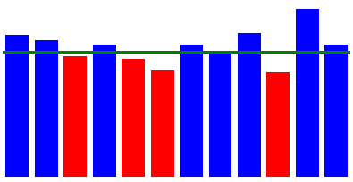

# Mitjana de vendes



Ens demanen un programa per a generar els gràfics de la **mitjana mensual** de vendes d'una empresa, a partir de les dades de vendes de cada dia de l'any.

El gràfic ha de mostrar també la **mitjana anual per mesos** i marcar quins mesos estàn per sota d'aquesta mitjana.

## Input

L'entrada consta del volum de vendes de cada dia de l'any (comptant amb que febrer té sempre 28 dies) en format CSV.

## Output

S'imprimirà el codi HTML que genera el gràfic de vendes mensual:

```text

```

La propietat  de cada DIV correspon a la mitjana mensual de vendes del mes corresponent.

El color de fons de cada DIV es  si la mitjana d'aquell mes està per sota de la mitjana anual, i  si és igual o superior.

La propietat  de l'últim DIV correspon a la mitjana anual per mesos.
