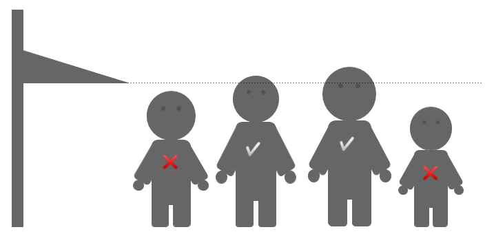

# Altura mínima



Avuí a l'escola fan una sortida al parc d'atraccions. La professora ha apuntat l'alçada de cada nen i nena, per veure qui podrà pujar a la muntanya russa i qui no.

## Input

L'entrada consta de tres parts:

- El primer nombre  indica el nombre de nens i nenes (*int*)

- A continuació venen les seves alçades (*float*)

- Per últim, el nombre  indica l'alçada mínima de la muntanya russa (*float*)

## Output

S'imprimirà  o  en una línia, per a cadascun dels nens i nenes

## Tests

### Test
```input
5
1.50
1.40
1.55
1.35
1.40
1.45
```
```output
SI
NO
SI
NO
NO
```

### Test
```input
3
1.30
1.40
1.50
1.40
```
```output
NO
SI
SI
```

### Test
```input
4
1.44
1.45
1.46
1.47
1.44
```
```output
SI
SI
SI
SI
```

### Test
```input
1
1.51
1.51
```
```output
SI
```

### Test
```input
10
1.46
1.43
1.56
1.57
1.50
1.51
1.39
1.45
1.60
1.47
1.50
```
```output
NO
NO
SI
SI
SI
SI
NO
NO
SI
NO
```

### Test
```input
2
1.40
1.50
1.45
```
```output
NO
SI
```
