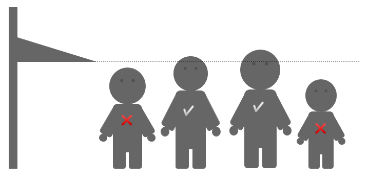

# Altura mínima

Avuí a l'escola fan una sortida al parc d'atraccions. La professora ha apuntat l'alçada de cada nen i nena, per veure qui podrà pujar a la muntanya russa i qui no.

## Input

L'entrada consta de tres parts:

- El primer nombre  indica el nombre de nens i nenes (*int*)

- A continuació venen les seves alçades (*float*)

- Per últim, el nombre  indica l'alçada mínima de la muntanya russa (*float*)

## Output

S'imprimirà  o  en una línia, per a cadascun dels nens i nenes
