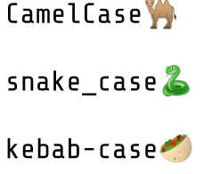

# CaSe StYlEs

Existeixen nombroses convencions a l'hora d'escollir la seqüència de caracters que s'usa com a identificador de variables, tipus, funcions, ...

Normalment, a cada llenguatge hi ha unes convencions, encara que cada organització té el seu propi estil.

Les més comuns són:

- CamelCase : Java, C#, Javascript, Go, Ruby, JSON

- snake_case : Python, PHP, C, C++

- kebab-case : Lisp, XML



## Input

Les paraules que componen l'identificador

No hi ha restriccions sigificatives

## Output

S'escriurà l'identificador en CamelCase, snake_case i kebab-case.

En CamelCase cada paraula comença en majúscules, i no es separen amb espais.

En snake_case les paraules es separen amb _ i es posen en majúscules si totes les lletres són majúscules. Si hi ha alguna lletra minúscula, es posen totes les lletres en minúscula.

En kebab-case totes les lletres van sempre en minúscula, i separades amb -

## Tests

### Test
```input
case styles
```
```output
CaseStyles
case-styles
case_styles
```

### Test
```input
case styles
```
```output
CaseStyles
case-styles
case_styles
```

### Test
```input
CASE STYLES
```
```output
CaseStyles
case-styles
CASE_STYLES
```

### Test
```input
CAsE STYLES
```
```output
CaseStyles
case-styles
case_styles
```

### Test
```input
Fork join worker thread factory
```
```output
ForkJoinWorkerThreadFactory
fork-join-worker-thread-factory
fork_join_worker_thread_factory
```

### Test
```input
abstract transactional data source spring context tests
```
```output
AbstractTransactionalDataSourceSpringContextTests
abstract-transactional-data-source-spring-context-tests
abstract_transactional_data_source_spring_context_tests
```
