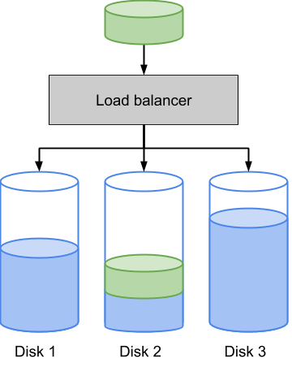

# Balanceig de càrrega

El balanceig de càrrega consisteix en la distribució de la feina a realitzar entre diferents recursos com ordinadors, clústers, línies de xarxa, unitats centrals de processament o dispositius de disc.

En aquest problema tractarem el balanceig de càrrega de dispositius de disc en funció de l'espai disponible.

Quan s'ha d'emmagatzemar un bloc de dades, el balancejador de càrrega escull el disc amb més espai disponible per a emmagaztemar-les:

## Input

En primer lloc trobem el nombre de discs .

A continuació ve l'espai ocupat a cada disc.

Seguidament ve un seqüència amb els tamanys dels blocs de dades que s'han d'emmagatzemar. La seqüència finalitza amb un 0.

## Output

S'imprimirà l'espai ocupat en cada disc un cop s'han emmagatzemat tots els blocs.
