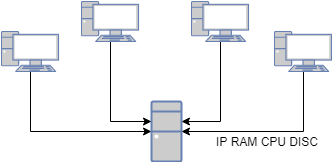

# Inventari en ordre

El software d'inventari que tenim a la xarxa obté diversa informació sobre l'estat dels equips de la xarxa. Hem configurat aquest software per a que reculli la següent informació de cada màquina:

- Adreça IP

- Memòria RAM instal·lada (Gb)

- Velocitat del processador (MHz)

- Espai de disc (Gb)



Amb la informació recopilada podem generar l'inventari de màquines de la xarxa.

Ara el que ens interessa és poder ordenar l'inventari segons els diversos camps, establint l'ordre en que s'han de comparar aquests camps.

## Input

La primera línia indica l'ordre dels camps pels quals volem ordenar l'inventari. Per exemple:

```text
RAM DISC CPU IP
```

A continuació ve l'inventari en diverses línies. A cada línia hi trobem la informació d'un host (IP, RAM, CPU, DISC). Per exemple:

```text
192.168.1.1 16 4000 500
```

La entrada acaba amb la línia "**END**"

No hi ha

## Output

S'imprimirà l'inventari ordenat segons els camps indicats.

## Tests

### Test
```input
CPU RAM DISC IP
192.168.1.1 8 4000 500
192.168.1.2 16 2000 500
192.168.1.3 8 2000 200
192.168.1.4 8 2000 200 
192.168.1.5 8 2000 400
__END__
```
```output
192.168.1.1 8 4000 500
192.168.1.2 16 2000 500
192.168.1.5 8 2000 400
192.168.1.3 8 2000 200
192.168.1.4 8 2000 200
```

### Test
```input
CPU RAM DISC IP
192.168.1.1 8 4000 500
192.168.1.2 16 2000 500
192.168.1.3 8 2000 200
192.168.1.4 8 2000 200 
192.168.1.5 8 2000 400
__END__
```
```output
192.168.1.1 8 4000 500
192.168.1.2 16 2000 500
192.168.1.5 8 2000 400
192.168.1.3 8 2000 200
192.168.1.4 8 2000 200
```

### Test
```input
CPU DISC RAM IP
192.168.0.1 4 3000 120
192.168.0.2 4 3000 120
192.168.0.12 4 3000 120
192.168.0.22 4 3000 120
__END__
```
```output
192.168.0.1 4 3000 120
192.168.0.2 4 3000 120
192.168.0.12 4 3000 120
192.168.0.22 4 3000 120
```

### Test
```input
IP CPU RAM DISC
10.1.1.2 8 2000 500
10.2.1.3 16 3000 1000
10.1.2.2 4 4000 250
10.2.2.1 6 3500 400
10.0.2.2 2 1000 120
__END__
```
```output
10.0.2.2 2 1000 120
10.1.1.2 8 2000 500
10.1.2.2 4 4000 250
10.2.1.3 16 3000 1000
10.2.2.1 6 3500 400
```

### Test
```input
DISC CPU RAM IP
192.168.35.64   4 2000 500
192.168.127.64  4 3000 500
192.168.127.127 8 2000 500
192.168.254.100 4 2000 1000
192.168.80.8    8 3000 1000
192.168.10.8    4 2000 500
192.168.1.8     8 2000 500
192.168.25.100  4 3000 500
192.168.2.100   4 2000 1000
__END__
```
```output
192.168.80.8 8 3000 1000
192.168.2.100 4 2000 1000
192.168.254.100 4 2000 1000
192.168.25.100  4 3000 500
192.168.127.64  4 3000 500
192.168.1.8     8 2000 500
192.168.127.127 8 2000 500
192.168.10.8    4 2000 500
192.168.35.64   4 2000 500
```
