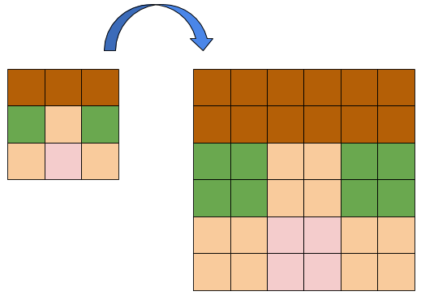

# Nearest-neighbour interpolation

Nearest-neighbour interpolation és un algoritme d'escalat d'imatges.
Quan fem una imatge més gran, l'algoritme Nearest-neighbour genera els nous pixels a partir dels originals més propers:

Aquest algoritme funciona bé per a imatges 'pixel-art', però no és el més adequat per a imatges fotogràfiques ja que crea "dents de serra".

## Input

La entrada consisteix en una imatge en ASCII-ART.
En primer lloc ve el tamany en línies  de la imatge, i a continuació la imatge.

Finalment venen el factor d'escalat horitzontal  i el vertical .

## Output

S'imprimirà la imatge escalada segons els factors horitzontal i vertical.
