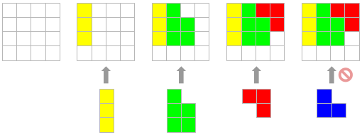

# Organitzant el magatzem

Una empresa de logística té desitja revisar la política de col·locació de productes al magatzem.
Actualment la política és colocar els productes que van arribant el més al fons i a l'esquerra possible:



Aquesta política però, no és l'òptima, ja que els productes s'haurien pogut col·locar d'aquesta altra forma:


L'empresa desitja realitzar algunes simulacions per a detectar quan ocorren aquests problemes i poder aplicar estratègies diferents.

## Input

L'entrada consta en primer lloc del tamany del magatzem (MxN).
A continuació venen els productes que s'han d'emmagatzemar.
Primer ve el nombre de productes que venen a continuació.
Per a cada producte s'indica el nombre de línies de la seva figura, i a continuació ve la figura.

No hi ha

## Output

S'imprimirà la distribució final en que queda el magatzem. Els espais buits del magatzem s'indiquen amb un punt.

## Tests

### Test 14.29
```input
4 4
4
3
a
a
a
3
b
bb
bb
2
cc
 c
2
d
dd
```
```output
abcc
abbc
abb.
....
```

### Test 14.29
```input
4 4
4
3
a
a
a
3
b
bb
bb
2
cc
 c
2
d
dd
```
```output
abcc
abbc
abb.
....
```

### Test private 14.29
```input
3 3
2
3
pp
p
pp
3
 x
xx
 x
```
```output
ppx
pxx
ppx
```

### Test private 14.29
```input
3 4
3
2
oooo
oooo
2
xx
xx
1
mmmmm
```
```output
oooo
oooo
....
```

### Test private 14.29
```input
8 8
8
5
eeeee
ee
eeee
ee
eeeee
3
ooo
o o
ooo
1
a
4
i
i
i
i
2
u u
uuu
3
x x
 x
x x
3
y   y
 y y
  y
2
zz
zz
```
```output
eeeeeooo
eea..o.o
eeee.ooo
ee...izz
eeeeeizz
u.uy.i.y
uuu.yiy.
.....y..
```

### Test private 14.29
```input
3 6
8
2
 ss
ss
2
w w w
wwwww
2
ttt
 t
2
l
ll
2
v v
 v
2
u u
uuu
2
 j
jj
2
zz
 zz
```
```output
.ssttt
sslvtv
..llv.
```

### Test private 14.26
```input
5 10
10
1
iiii
2
 t
ttt
3
s
ss
 s
2
  l
lll
2
oo
oo
3
 j
 j
jj
2
zz
 zz
4
i
i
i
i
3
l
l
ll
3
t
tt
t
```
```output
iiiit.s.oo
..ltttssoo
llljzz.sl.
...j.zz.l.
..jj....ll
```
