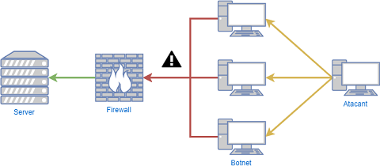
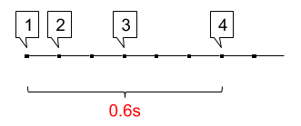
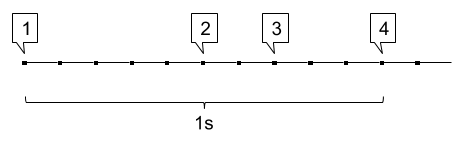
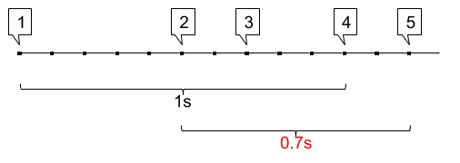
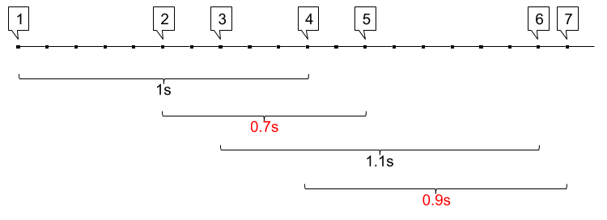
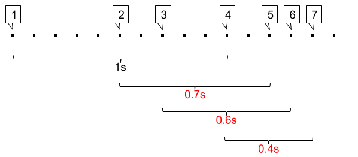

# DDoS

Desitjem implementar una sistema d'alerta d'atacs de denegació de servei (DDoS). Aquests atacs consisteixen en que l'atacant realitza una gran quantitat de connexions utilitzant una botnet.



Una forma de prevenir aquests atacs és mitjançant una política que denegui les connexions si aquestes es produeixen amb massa freqüència (connexions/temps).

Implementarem al firewall un sistema de detecció d'atacs DDoS, que alerti quan es produeixen més connexions de les permeses en un període de temps. 

Establirem aquesta política a 4 connexions en 1 segon. Cada cop que es superi aquesta freqüència es mostrarà una alerta.

## Input

La entrada consisteix en una seqüència de *floats* que indiquen el temps (T) que ha passat entre una connexió i la següent.

La seqüencia acaba amb -1.

## Output

S'imprimirà el missatge "DDos alert", cada cop que es superin les 4 connexions en menys d'1 segon.

## Tests

### Test
```input
0.2  0.2  0.3      -1.0
```
```output
DDoS alert
```
```explanation


Es produeix la primera connexió

Passen 0.1 segons i es produeix la segona connexió

Passen 0.2 segons i es produeix la tercera connexió

Passen 0.3 segons i es produeix la quarta connexió

S'han produït 4 connexions en 0.6 segons
```

### Test
```input
0.1  0.2  0.3      -1
```
```output
DDoS alert
```
```explanation


Es produeix la primera connexió

Passen 0.5 segons i es produeix la segona connexió

Passen 0.2 segons i es produeix la tercera connexió

Passen 0.3 segons i es produeix la quarta connexió

S'han produït 4 connexions en 1 segon, és a dir, no s'ha superat el límit.
```

### Test
```input
0.5  0.2  0.3      -1
```
```output
```
```explanation


Es produeix la primera connexió

Passen 0.5 segons i es produeix la segona connexió

Passen 0.2 segons i es produeix la tercera connexió

Passen 0.3 segons i es produeix la quarta connexió

Passen 0.2 segons i es produeix la cinquena connexió

Entre la segona i la cinquena connexió han passat 0.7 segons, és a dir, s'ha superat el límit.
```

### Test
```input
0.5  0.2  0.3  0.2      -1
```
```output
DDoS alert
```
```explanation


S'han produït dues alertes: 

entre la segona i cinquena connexió (0.2+0.3+0.2)

i entre la quarta i la setena (0.2+0.6+0.1).
```

### Test
```input
0.5  0.2  0.3  0.2  0.6  0.1      -1
```
```output
DDoS alert
DDoS alert
```
```explanation


0.2+0.3+0.2

0.3+0.2+0.1

0.2+0.1+0.1
```

### Test
```input
0.5  0.2  0.3  0.2  0.1  0.1      -1
```
```output
DDoS alert
DDoS alert
DDoS alert
```

### Test
```input
0.5  0.2  0.3  1.2  0.1  0.1  0.1  0.1  0.7  0.4  0.1  0.2  0.6      -1
```
```output
DDoS alert
DDoS alert
DDoS alert
DDoS alert
DDoS alert
```

### Test private
```input
0.3  0.3  0.3  0.2  0.2  0.5  0.2  0.1  0.1  0.1  0.1  0.7  0.4  0.1  0.2  0.6  0.9  0.1      -1
```
```output
DDoS alert
DDoS alert
DDoS alert
DDoS alert
DDoS alert
DDoS alert
DDoS alert
DDoS alert
DDoS alert
DDoS alert
DDoS alert
DDoS alert
```
