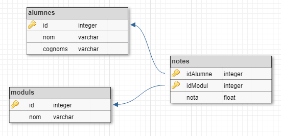

# Doble JOIN

Donades les tuples de les següents relacions:


Realitza la següent consulta:

```
SELECT cognoms, nom, moduls.nom AS modul, nota 
FROM alumnes 
    JOIN notes ON alumnes.id = notes.idAlumne
    JOIN moduls ON moduls.id = notes.idModul
```

## Input

La entrada consisteix en les tuples per a les taules 'alumnes', 'moduls' i 'notes'.
En primer lloc va el nombre de tuples i després les tuples, cadascuna en una línia.

Per a la taula **alumnes** el format de cada tupla és:

```
id cognoms, nom
```

Per a la taula **moduls** el format és:

```
id nom
```

Per a la taula **notes** el format és:

```
idAlumne idModul nota
```

## Output

La sortida serà el resultat de la consulta en format taula:

```
cognoms|nom|modul|nota
-------+---+-----+----
       |   |     |
```

L'amplada de cada columna serà igual a la longitud màxima dels seus valors. La nota s'haurà de posar amb dos decimals. 

Tot el text s'ha d'aliniar a la dreta.

Per últim caldrà indicar el número de tuples retornades per la consulta: "(X rows)"

## Tests

### Test
```input
2
1 Turing, Alan
2 Codd, Edgar

2
1 Programacio
2 Bases de dades

4
1 1 10
1 2 9
2 1 9
2 2 10
```
```output
cognom|nom  |modul         |nota 
------+-----+--------------+-----
Turing|Alan |Programacio   |10.00
Turing|Alan |Bases de dades| 9.00
Codd  |Edgar|Programacio   | 9.00
Codd  |Edgar|Bases de dades|10.00
(4 rows)
```

### Test
```input
1
1 Von Neumann, John

1
1 Fonaments de Hardware

1
1 1 10
```
```output
cognom     |nom |modul                |nota 
-----------+----+---------------------+-----
Von Neumann|John|Fonaments de Hardware|10.00
(1 rows)
```

### Test
```input
1
4096 Von Neumann, John

1
128 Fonaments de Hardware

1
4096 128 10
```
```output
cognom     |nom |modul                |nota 
-----------+----+---------------------+-----
Von Neumann|John|Fonaments de Hardware|10.00
(1 rows)
```

### Test
```input
3
101 Torvalds, Linus
203 Cerf, Vint
443 Rubin, Andy

4
12 Implantacio de sistemes operatius
23 Programacio
41 Planificacio i administracio de xarxes
15 Programacio multimedia i dispositius mobils

8
101 12 10
101 41 8
203 12 7
203 31 10
203 12 7
443 12 10
443 41 9
443 23 8
```
```output
cognom  |nom  |modul                                      |nota 
--------+-----+-------------------------------------------+-----
Torvalds|Linus|Implantacio de sistemes operatius          |10.00
Torvalds|Linus|Planificacio i administracio de xarxes     | 8.00
Cerf    |Vint |Implantacio de sistemes operatius          | 7.00
Cerf    |Vint |Implantacio de sistemes operatius          | 7.00
Rubin   |Andy |Implantacio de sistemes operatius          |10.00
Rubin   |Andy |Planificacio i administracio de xarxes     | 9.00
Rubin   |Andy |Programacio                                | 8.00
(7 rows)
```

### Test
```input
4
99 Codd, Edgar
76 Berners-Lee, Tim
47 Von Neumann, John
10 Marx, Karl

6
12 Gestio de bases de dades
13 Llenguatges de marques
14 Fonaments de maquinari
15 Planificacio i administracio de xarxes
16 Formacio i orientacio laboral
17 Empresa i iniciativa emprenedora

11
47 14 10
99 16 6
10 17 10
76 14 6
10 16 10
47 12 10
99 12 10
47 13 10
76 13 10
10 15 5
47 15 10
```
```output
cognom     |nom  |modul                                 |nota 
-----------+-----+--------------------------------------+-----
Codd       |Edgar|Formacio i orientacio laboral         | 6.00
Codd       |Edgar|Gestio de bases de dades              |10.00
Berners-Lee|Tim  |Fonaments de maquinari                | 6.00
Berners-Lee|Tim  |Llenguatges de marques                |10.00
Von Neumann|John |Fonaments de maquinari                |10.00
Von Neumann|John |Gestio de bases de dades              |10.00
Von Neumann|John |Llenguatges de marques                |10.00
Von Neumann|John |Planificacio i administracio de xarxes|10.00
Marx       |Karl |Empresa i iniciativa emprenedora      |10.00
Marx       |Karl |Formacio i orientacio laboral         |10.00
Marx       |Karl |Planificacio i administracio de xarxes| 5.00
(11 rows)
```

### Test private
```input
7
87 Dijkstra, Edsger
10 Knuth, Donald
1 Floyd, Robert
23 Thompson, Ken
56 Ritchie, Dennis
96 Kay, Alan
44 Liskov, Barbara

1
106 Programacio basica

7
87 106 10
10 106 10
1 106 10
23 106 10
56 106 10
96 106 10
44 106 10
```
```output
cognom |nom    |modul             |nota 
-------+-------+------------------+-----
Dijkstra|Edsger |Programacio basica|10.00
Knuth  |Donald |Programacio basica|10.00
Floyd  |Robert |Programacio basica|10.00
Thompson|Ken    |Programacio basica|10.00
Ritchie|Dennis |Programacio basica|10.00
Kay    |Alan   |Programacio basica|10.00
Liskov |Barbara|Programacio basica|10.00
(7 rows)
```
