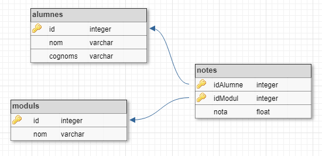

# Doble JOIN

Donades les tuples de les següents relacions:


Realitza la següent consulta:

```text
SELECT cognoms, nom, moduls.nom AS modul, nota
FROM alumnes
    JOIN notes ON alumnes.id = notes.idAlumne
    JOIN moduls ON moduls.id = notes.idModul
```

## Input

La entrada consisteix en les tuples per a les taules 'alumnes', 'moduls' i 'notes'.
En primer lloc va el nombre de tuples i després les tuples, cadascuna en una línia.

Per a la taula **alumnes** el format de cada tupla és:

```text
id cognoms, nom
```

Per a la taula **moduls** el format és:

```text
id nom
```

Per a la taula **notes** el format és:

```text
idAlumne idModul nota
```

No hi ha cap restricció significativa

## Output

La sortida serà el resultat de la consulta en format taula:

```text
cognoms|nom|modul|nota
-------+---+-----+----
       |   |     |
```

L'amplada de cada columna serà igual a la longitud màxima dels seus valors. La nota s'haurà de posar amb dos decimals.

Tot el text s'ha d'aliniar a la dreta.

Per últim caldrà indicar el número de tuples retornades per la consulta: "(X rows)"
