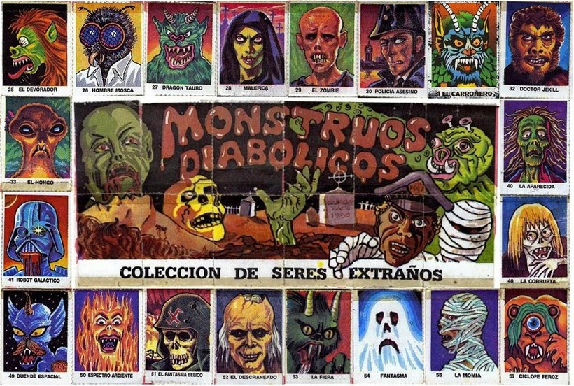

# Cromos repetits



David s'està fent una col·lecció de cromos. S'ha fet una app per a portar l'inventari de cromos que té. Ara vol que l'app li digui quins cromos té repetits.

En total hi ha 68 cromos. Estan identificats amb números consecutius de l'1 al 68.

## Input

Un número  indica la quantitat de cromos.

A continuació venen els identificadors de cada cromo.

## Output

S'imprimirà l'identificador dels cromos que té repetits, i quantes vegades el té repetit. Ordenats per identificador i en línies diferents.

El format és:

```text
id: vegades
```
