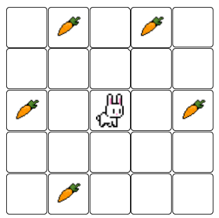

# El conill i les pastanagues



Ajuda al conill a menjar-se la pastanagues!

El conill es troba inicialment en el centre de la graella, i es pot moure en les quatre direccions, una casella cada vegada.

Quants moviments necessita per a menjar-se totes les pastanagues **en l'ordre correcte**?

## Input

En primer lloc ve un nombre imparell  que indica el tamany de la graella: .

A continuació ve la graella. Les pastanagues estan indicades amb el número d'ordre en què s'han de menjar.

## Output

S'escriurà el nombre de moviments que necessita el conill per a menjar-se totes les pastanagues en l'ordre correcte.

## Tests

### Test
```input
3
1 0 0
0 0 0
2 0 0
```
```output
4
```

### Test
```input
3
1 0 0
0 0 0
3 0 2
```
```output
8
```

### Test
```input
5
0 0 3 0 0
0 1 0 2 0
0 0 0 0 0
0 0 0 0 0
0 0 4 0 0
```
```output
10
```

### Test
```input
5
0 0 0 0 0
0 2 3 4 0
0 1 0 5 0
0 8 7 6 0
0 0 0 0 0
```
```output
8
```

### Test
```input
5
0 0 0 0 0
0 3 2 4 0
0 1 0 6 0
0 8 7 5 0
0 0 0 0 0
```
```output
12
```

### Test
```input
9
10  0  5  0  0  0  0  0 12
 0  0  0  0  0  4  0  0  0
 0  0  0  0  0  0  0  0  7
 1  0  0  0  0  0  0  0  0
 0  0  0  0  0  0 11  0  0
 0  0  0  0  0  0  0  0  0
 0  0  0  6  0  0  2  0  0
 0  3  0  0  0  0  0  0  0
 8  0  0  0  0  0  0  0  9
```
```output
104
```

### Test
```input
3
4 0 3
0 0 0
2 0 1
```
```output
10
```
