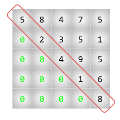

# Zeros sota la diagonal



Donada una matriu quadrada de nombres, digues si tots els nombres per sota de la diagonal són 0.

## Input

El primer nombre  indica el tamany de la matriu (x).

A continuació venen els nombres de la matriu.

## Output

{ SI | NO }

## Tests

### Test 6.25
```input
2
1 1
0 1
```
```output
SI
```

### Test 6.25
```input
2
1 2
0 4
```
```output
SI
```

### Test private 6.25
```input
3
0 0 0
0 0 0
0 0 0
```
```output
SI
```

### Test private 6.25
```input
4
1 2 3 4
0 2 3 4
0 0 3 4
0 0 0 4
```
```output
SI
```

### Test private 6.25
```input
3
0 0 0
1 0 0
0 0 0
```
```output
NO
```

### Test private 6.25
```input
3
0 0 0
0 1 0
0 0 0
```
```output
SI
```

### Test private 6.25
```input
3
0 0 0
0 0 0
1 0 0
```
```output
NO
```

### Test private 6.25
```input
3
0 0 0
0 0 0
0 1 0
```
```output
NO
```

### Test private 6.25
```input
5
11 12 13 14 15
21 22 23 24 25
31 32 33 34 35
41 42 43 44 45
51 52 53 54 55
```
```output
NO
```

### Test private 6.25
```input
5
11 12 13 14 15
 0 22 23 24 25
 0  0 33 34 35
 0  0  0 44 45
 0  0  0  0 55
```
```output
SI
```

### Test private 6.25
```input
2
1 2 0 3
```
```output
SI
```

### Test private 6.25
```input
3
1 2 3 0 4 5 0 0 6
```
```output
SI
```

### Test private 6.25
```input
9
 1  5  7  3  6  4  0  0  9 
 0  7  8  5  0  9  3  6  3 
 0  0  6  8  9  6  8  1  5 
 0  0  0  3  4  8  8  5  9 
 0  0  0  0  0  1  8  8  8 
 0  0  0  0  0  8  7  3  1 
 0  0  0  0  0  0  1  3  4 
 0  0  0  0  0  0  0  0  6 
 0  0  0  0  0  0  0  0  2
```
```output
SI
```

### Test private 6.25
```input
13
 8  4  7  6  8  2  6  9  4  1  7  9  4 
 6  5  5  0  1  8  8  1  3  3  4  2  0 
 7  1  2  4  6  4  0  2  4  9  3  6  6 
 2  7  3  5  7  6  0  0  2  7  3  2  3 
 3  7  8  7  1  6  0  3  0  9  6  7  9 
 4  5  0  3  1  7  1  1  9  3  4  0  4 
 1  2  4  7  1  4  2  3  3  2  0  0  0 
 7  6  9  1  9  4  6  2  3  7  1  1  5 
 7  7  1  7  5  6  7  1  2  1  1  5  0 
 4  8  8  3  7  1  3  9  6  1  7  5  4 
 4  5  9  0  1  0  0  3  8  6  3  1  0 
 2  8  1  2  6  1  5  0  1  0  3  0  9 
 7  5  5  0  3  3  9  1  6  0  0  3  2
```
```output
NO
```

### Test private 6.25
```input
5
 6  8  1  3  6 
 7  1  9  4  0 
 1  9  8  4  3 
 5  6  5  8  0 
 4  0  5  8  2
```
```output
NO
```

### Test private 6.25
```input
9
 0  6  6  9  1  7  0  8  7 
 0  2  4  1  8  6  8  0  4 
 0  0  5  6  2  5  2  0  8 
 0  0  0  6  9  9  1  3  2 
 0  0  0  0  2  8  5  5  5 
 0  0  0  0  0  5  6  5  0 
 0  0  0  0  0  0  2  1  1 
 0  0  0  0  0  0  0  8  5 
 0  0  0  0  0  0  0  0  4 
```
```output
SI
```
