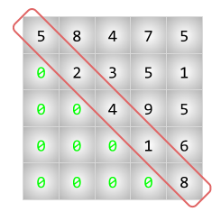

# Zeros sota la diagonal

Donada una matriu quadrada de nombres, digues si tots els nombres per sota de la diagonal són 0.

## Input

El primer nombre  indica el tamany de la matriu (x).

A continuació venen els nombres de la matriu.

## Output

{ SI | NO }
