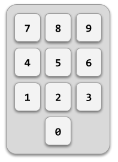

# Combinación secreta de la caja fuerte



En una caja fuerte de combinación hay que introducir los números de la combinación secreta en el orden correcto para abrirla.

## Input

La entrada consiste en primer lugar en tres números que indican la combinación secreta.

A continuación viene la secuencia de números introducidos (como mínimo 3). La secuencia termina con -1.

## Output

Se imprimirá "ABIERTA" si se ha introducido en algún momento la combinación secreta o "CERRADA" en caso contrario.

## Tests

### Test
```input
13 42 25
66 13 42 25 77    -1
```
```output
ABIERTA
```

### Test
```input
7 11 17
9 3 7 11 17   -1
```
```output
ABIERTA
```

### Test
```input
7 11 17
9 3 7 11 15 17   -1
```
```output
CERRADA
```

### Test
```input
1 1 1
1 1 2 1 1 2    -1
```
```output
CERRADA
```
