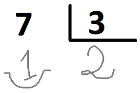

# Corregint els deures

A un alumne li han manat de deures fer un munt de divisions. Quan les ha acabades li demana a son pare si li pot ajudar a corregir-les. El pare, que té molt de treball i no té temps per a corregir divisions, decideix programar una intel·ligència artificial per a que les corregeixi en el seu lloc. Usant una tècnica de Reconeixement Òptic de Caracters, aconsegueix digitalitzar les divisions.

Per exemple, de la següent divisió



es digitalitza el **Dividend**, el **Divisor**, el **Quocient** i el **Residu**, i s'obté:

```text
7 3 2 1
```

No obstant, el pare no és capac d'implementar un programa que, un cop digitalitzades les divisions, digui si són o no correctes. ¿Podries ajudar-lo?

El programa haurà de dir quines divisions són incorrectes, i donar el seu resultat correcte.

## Input

L'entrada consta de  divisions.

Per a cada divisió s'indiquen el , el , el  i el .

L'entrada acaba amb quatre zeros.

>= 1

 >= 0

 >= 1

 >= 0

 >= 0

## Output

De les divisions incorrectes, el programa haurà de mostrar el número de divisió, i el resultat correcte (quocient i residu), separades per un salt de línia i amb el següent format:

```text
número) quocient residu
```
