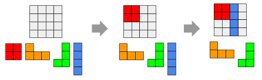

# Cubetris

En el juego Cubetris, el jugador va colocando unas piezas sobre un tablero intentando cubrir por completo el tablero. Puede poner las piezas en la posición que quiera, y la única limitación es que estas no pueden superponerse.

Por ejemplo, el jugador podría superar el juego así:

Si embargo, si juego de esta otra forma, no podría superar el juego, ya que las piezas verde y naranja no habría forma de colocarlas sin superponerse a otras piezas:

Deseamos programar la parte del juego que nos dice si una pieza se puede colocar en una posición, o por el contrario no se puede debido a que se superpondría a otras piezas.

## Input

Los dos primeros números indican el tamaño del tablero:  y , respectivamente.

A continuación viene la definición del estado del tablero. Cada número indica el color de la pieza que esta en esa posición. Un cero significa que la posición está vacía.

Por último viene un tablero que define la pieza que se quiere colocar.

## Output

Se imprimirá el tablero resultante tras tras colocar (o no) la pieza.
