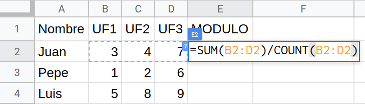

# Full de notes



## Input

La entrada és la matriu de notes

## Output

S'imprimirà la matriu de notes, afegint la columna de la mitjana.

## Tests

### Test
```input
3 4
4 6 5 5
8 8 6 6
4 5 6 5
```
```output
4 6 5 5 5.0
8 8 6 6 7.0
4 5 6 5 5.0
```

### Test
```input
4 3
4 6 5
8 8 6
4 5 6
9 6 5
```
```output
4 6 5 5.0
8 8 6 7.3333335
4 5 6 5.0
9 6 5 6.6666665
```

### Test
```input
2 6
4 6 5 8 8 6
4 5 6 9 6 5
```
```output
4 6 5 8 8 6 6.1666665
4 5 6 9 6 5 5.8333335
```

### Test
```input
2 2
4 6
4 5
```
```output
4 6 5.0
4 5 4.5
```
