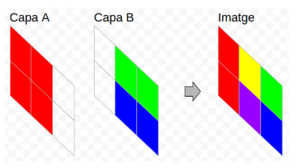

# Superposición de capas

Los programas de edición de imágenes suelen tener soporte para capas. De esta forma, una imagen se genera a partir de la composición de sus capas. Hay varios modos de componer las capas (blending modes). Por ejemplo están el modo **Normal** y el modo **Adición**.

Modo Normal:
En el modo Normal las capas superiores cubren a las capas inferiores. Es decir, cada píxel de una capa superior cubre a los píxeles de las capas inferiores que están en la misma posición, excepto si dicho píxel es transparente.

Modo Adición:
En el modo Adición, los píxeles de cada capa que están en la misma posición se suman para obtener el color del píxel resultante.

El color de un píxel se expresa con un número. **Los píxeles transparentes se representan con un 0**.

## Input

Los dos primeros números indican el tamaño de la imagen:  y , respectivamente.

A continuación viene el color de cada píxel de la capa  y después de la capa .

Por último, se expresa el  que hay que aplicar para generar la imagen: ADD o NORMAL.

## Output

Se imprimirá la imagen resultante tras aplicar el blending mode indicado a las dos capas.
