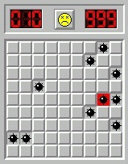

# Trobant mines



Donat un tauler del buscamines, s'ha de dir en quines posicions (fila i columna) es troben les mines.

## Input

L'entrada consisteix en primer lloc de dos nombres  i , que indiquen el nombre de files i columnes que té el tauler.
A continuació venen les caselles del tauler (0, 1)

Les caselles sense mines es representen amb un  i les que tenen mina amb un .

## Output

S'escriurà la posició (fila i columna, separades per un espai) de cada mina trobada.

## Tests

### Test
```input
2 2
0 1
0 0
```
```output
1 2
```

### Test
```input
3 3
1 0 0
0 0 0
0 0 1
```
```output
1 1
3 3
```

### Test
```input
3 4
1 1 0 0
0 0 1 0
0 1 0 0
```
```output
1 1
1 2
2 3
3 2
```

### Test
```input
1 1
1
```
```output
1 1
```

### Test
```input
5 5
0 0 0 0 0
0 0 0 0 0
0 0 1 0 0
0 0 0 0 0
0 0 0 0 0
```
```output
3 3
```

### Test
```input
1 4
0 1 0 1
```
```output
1 2
1 4
```

### Test
```input
4 1
0
1
0
1
```
```output
2 1
4 1
```

### Test
```input
7 6
0 1 0 1 1 0
1 1 1 0 0 0
0 0 1 1 1 0
1 0 0 0 1 1
1 1 0 1 0 0
0 0 0 1 1 1
1 0 0 0 1 1
```
```output
1 2
1 4
1 5
2 1
2 2
2 3
3 3
3 4
3 5
4 1
4 5
4 6
5 1
5 2
5 4
6 4
6 5
6 6
7 1
7 5
7 6
```
