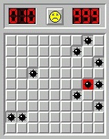

# Trobant mines

Donat un tauler del buscamines, s'ha de dir en quines posicions (fila i columna) es troben les mines.

## Input

L'entrada consisteix en primer lloc de dos nombres  i , que indiquen el nombre de files i columnes que té el tauler.
A continuació venen les caselles del tauler (0, 1)

Les caselles sense mines es representen amb un  i les que tenen mina amb un .

## Output

S'escriurà la posició (fila i columna, separades per un espai) de cada mina trobada.
