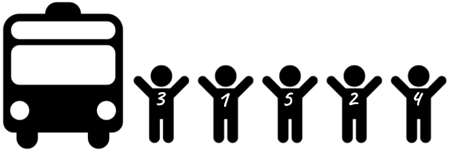

# Hi sou tots i totes?

En una sortida escolar, la mestra posa una enganxina a cada nen i nena amb un número correlatiu.

Quan arriba el moment de pujar a l'autobús els nens i nenes van pujant i la mestra va marcant a la seva llibreta els números dels que hi van pujant.

Quan han pujat tots els alumnes, la mestra revisa les seves anotacions per veure si estan tots els alumnes.

## Input

El primer número  indica el nombre d'alumnes. A continuació ve la seqüència de números.

## Output

"SI" si han pujat tots els alumnes.
"NO" en cas contrari.
