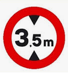

# Gàlib



El terme gàlib designa les dimensions màximes, tant d'alçada com d'amplada, que poden tenir els vehicles i embarcacions o la secció interna dels llocs per on han de passar (túnels, ponts, etc..).

En aquest programa s'ha d'indicar el primer pont amb el qual xocarà el vehicle.

## Input

L'entrada consta en primer lloc de l'alçada  del vehicle.

A continuació ve el número  de ponts que hi ha.

Per últim, venen les alçades dels  ponts.

## Output

S'indicarà `xoca amb el pont i`, on  és la posició del primer pont amb el qual xocarà el vehicle.

Si el vehicle **no xoca** amb cap pont, no s'ha d'imprimir res.

## Plantillas

```java
import java.util.Scanner;

public class Main {

    public static void main(String[] args) {
    	Scanner scanner = new Scanner(System.in);
      
      	
    }
}
```

## Tests

### Test
```input
2.9

10
3 4 3 2 2 4 3 3 4 3  
```
```output
xoca amb el pont 4
```

### Test
```input
2.5

5
2.4  3  3  4  3
```
```output
xoca amb el pont 1
```

### Test
```input
3

40
4 2 4 3 4 3 4 4 4 3 4 3 4 3 4 3 4 3 4 3 3 3 4 3 4 3 4 3 4 3 3 4 3 4 3 4 4 3 4 4
```
```output
xoca amb el pont 2
```

### Test
```input
1

40
4 3 4 3 4 3 4 4 4 3 4 3 4 3 4 3 4 3 4 3 3 3 4 3 4 3 4 3 4 3 3 4 3 4 3 4 4 3 4 4
```
```output
```

### Test
```input
3
4
4 4 4 4
```
```output
```

### Test
```input
3
4
2 4 4 4
```
```output
xoca amb el pont 1
```
