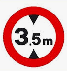

# Gàlib

El terme gàlib designa les dimensions màximes, tant d'alçada com d'amplada, que poden tenir els vehicles i embarcacions o la secció interna dels llocs per on han de passar (túnels, ponts, etc..).

En aquest programa s'ha d'indicar el primer pont amb el qual xocarà el vehicle.

## Input

L'entrada consta en primer lloc de l'alçada  del vehicle.

A continuació ve el número  de ponts que hi ha.

Per últim, venen les alçades dels  ponts.

## Output

S'indicarà `xoca amb el pont i`, on  és la posició del primer pont amb el qual xocarà el vehicle.

Si el vehicle **no xoca** amb cap pont, no s'ha d'imprimir res.
