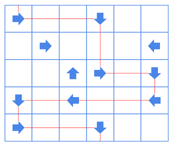

# Ice skating

En un videojuego hay un mapa en forma de tablero con unas flechas en algunas casillas que apuntan en una dirección: Norte, Sur, Este y Oeste.

El personaje empieza en la casilla 0,0, y desliza en la dirección de la flecha hasta que encuentra otra flecha, y entonces desliza en la dirección de esa flecha. Y así sucesivamente hasta que en un momento dado sale del tablero.

## Input

Los dos primeros números  y  indican el ancho y alto del tablero.

A continuación viene la definición del tablero:

- Un caracter `.` indica que la casilla no tiene flecha

- En las casillas con flecha se indica su dirección: `N`, `S`, `E`, `W`

## Output

Indicar las coordenadas (x y) de la última casilla del tablero por la cual sale el personaje.
