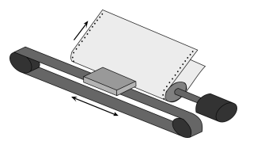

# Impresora matricial



La impresora matricial consta de un cabezal de impresión que se desplaza de izquierda a derecha imprimiendo sobre la página por impacto, oprimiendo una cinta de tinta contra el papel (similar a una máquina de escribir).

Una orden de impresión se representa con una serie de números:

- Un número X mayor o igual a cero significa desplazar el cabezal X posiciones e imprimir una #

- Un -1 indica avanzar una línea el papel y volver el cabezal al principio

- Un -2 significa que ha finalizado la impresión.

## Input

Una serie de números indicando las instrucciones de impresión. Termina con un -2 que indica el fin de la impresión.

## Output

Se imprimirá el resultado de la impresión. Cada desplazamiento del cabezal será un espacio en blanco, y cada punto de impresión una almohadilla.

## Tests

### Test
```input
3 2 1 0 -2
```
```output
   #  # ##
```

### Test
```input
0 0 0 -1 0 1 -1 1 -2
```
```output
###
# #
 #
```

### Test
```input
2 -1
1 1 -1
0 0 0 0 0 -1
2
-2
```
```output
  #
 # #
#####
  #
```

### Test
```input
3 2 -1 
2 0 0 0 0 0 -1 
1 0 0 0 0 0 0 0 -1 
0 0 0 1 0 1 0 0 -1
0 1 0 0 0 0 0 1 -1
0 2 2 2 -1
2 0 2 0 
-2
```
```output
   #  #
  ######
 ########
### ## ###
# ###### #
#  #  #  #
  ##  ##
```

### Test
```input
5 0 0 0 0 -1 3 0 5 0 -1 2 9 -1 1 11 -1 1 11 -1 0 0 0 0 0 0 0 0 0 0 0 0 0 0 0 -1 0 1 0 2 0 0 0 2 1 -1 0 1 0 0 1 1 0 0 1 1 -1 0 2 0 0 3 0 0 2 -1 0 13 -1 1 2 8 -1 1 3 0 0 0 0 3 -1 2 9 -1 3 0 5 0 -1 5 0 0 0 0 -1 -2
```
```output
     #####
   ##     ##
  #         #
 #           #
 #           #
###############
# ##  ####  # #
# ### # ### # #
#  ###   ###  #
#             #
 #  #        #
 #   #####   #
  #         #
   ##     ##
     #####
```
