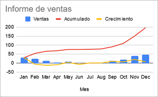

# Informe de vendes



Es requereix desenvolupar una aplicació que realitzi un informe de vendes.

A partir del volum de vendes de cada mes, l'informe ha d'incloure:

- El creixement mensual: consisteix en restar a les vendes de cada mes les vendes del mes anterior.

- Les vendes acumulades: es tracta de sumar a les vendes de cada mes les vendes de tots els mesos anteriors.

## Input

El primer número  indica la quantitat de mesos.

A continuació, el volum de vendes de cada mes.

## Output

S'imprimiràn, en format Array, el creixement i les vendes acumulades, cadascun en una línia.

*Es permet utilitzar el mètode `Arrays.toString()` per a imprimir els resultats*

## Plantillas

```java
import java.util.Arrays;
import java.util.Scanner;


public class Main {

    public static void main(String[] args) {
        Scanner scanner = new Scanner(System.in);
      	
      	
    }
}
```

## Tests

### Test
```input
5
10 20 50 70 120
```
```output
[10, 10, 30, 20, 50]
[10, 30, 80, 150, 270]
```

### Test
```input
3
100 150 250
```
```output
[100, 50, 100]
[100, 250, 500]
```

### Test
```input
4
1 3 6 10
```
```output
[1, 2, 3, 4]
[1, 4, 10, 20]
```

### Test
```input
1
1000
```
```output
[1000]
[1000]
```

### Test
```input
2
1000 1000
```
```output
[1000, 0]
[1000, 2000]
```

### Test
```input
10
5 4 3 6 4 8 7 4 1 2
```
```output
[5, -1, -1, 3, -2, 4, -1, -3, -3, 1]
[5, 9, 12, 18, 22, 30, 37, 41, 42, 44]
```
