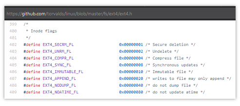

# Inode flags



Un arxiu de Linux té una sèrie d'atributs que es poden activar o desactivar amb la comanda `chattr`.

Els atributs que té activats/desactivats un arxiu es guarden amb una estructura anomenada **bit-field**:

- A cada atribut li correspon una puntuació.

- El **bit-field** és la suma de les puntuacions que corresponen als atributs que estan activats.

Els atributs que pot tenir un arxiu, i les seves puntuacions, són:

```text
+-------------------+-----------+---------------------------------+
|        Nom        | Puntuació |           Descripció            |
+-------------------+-----------+---------------------------------+
| EXT4_SECRM_FL     |         1 | Secure deletion                 |
| EXT4_UNRM_FL      |         2 | Undelete                        |
| EXT4_COMPR_FL     |         4 | Compress file                   |
| EXT4_SYNC_FL      |         8 | Synchronous updates             |
| EXT4_IMMUTABLE_FL |        16 | Immutable file                  |
| EXT4_APPEND_FL    |        32 | writes to file may only append  |
| EXT4_NODUMP_FL    |        64 | do not dump file                |
| EXT4_NOATIME_FL   |       128 | do not update atime             |
+-------------------+-----------+---------------------------------+
```

Per exemple: si un arixu té activats els atributs `EXT4_UNRM_FL` i `EXT4_APPEND_FL`, el seu **bit-field** serà **34**, que és la suma de la puntuació **2** de `EXT4_UNRM_FL` **més** la puntuació **32** de `EXT4_APPEND_FL`.

Escriu un programa que a partir del **bit-field** d'un fitxer imprimeixi els atributs que té activats.

## Input

Un número enter que representa el **bit-field** d'un arxiu.

## Output

S'imprimirà el **Nom** dels atributs que té activats el fitxer en ordre de major a menor puntuació:

```text
EXT4_NOATIME_FL
EXT4_NODUMP_FL
EXT4_APPEND_FL
EXT4_IMMUTABLE_FL
EXT4_SYNC_FL
EXT4_COMPR_FL
EXT4_UNRM_FL
EXT4_SECRM_FL
```

**Suggerència per a la solució**

Un possible solució al problema consisteix en tractar de restar al bit-field la puntuació de cada atribut (de més puntuació a menys).

Si es pot restar sense que quedi un número negatiu, aleshores és que té aquell atribut activat.

Per exemple: suposem que el bit-field es **34**:

- tractem de restar 128: no es pot

- tractem de restar 64: no es pot

- tractem de restar 32: sí es pot. Imprimim `EXT4_APPEND_FL`. Restem 32 i queda **2**

- tractem de restar 16: no es pot

- tractem de restar 8: no es pot

- tractem de restar 4: no es pot

- tractem de restar 2: sí es pot. Imprimim `EXT4_UNRM_FL`. Restem 2 i queda **0**

- tractem de restar 1: no es pot
