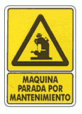

# Parada per manteniment



Una màquina d'una fàbrica s'ha de parar alguns dies durant unes hores per a realitzar-li el manteniment.
Es manté un registre de les hores que dura la jornada i les hores que ha estat en funcionament la màquina.
Es vol saber quants dies se li ha realitzat el manteniment, i quantes hores ha estat parada.

## Input

El primer número  indica el nombre de dies que hi ha al registre. A continuació venen les  dades del registre.

Cada registre consta de dos números:
*  indica les hores que dura la jornada aquell dia
*  indica les hores que ha estat en funcionament la màquina aquell dia

## Output

Dos números enters separats per espais en blanc

## Tests

### Test 20
```input
3
8 7    8 8     8 5
```
```output
2
4
```

### Test 20
```input
4
8 4   6 5    10 5    8 8
```
```output
3
10
```

### Test private 20
```input
5
8 8    6 6    5 5    7 7    10 10
```
```output
0
0
```

### Test private 20
```input
1
10 0
```
```output
1
10
```

### Test private 20
```input
3
9 4 8 5 7 6
```
```output
3
9
```
