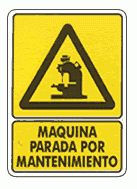

# Parada per manteniment

Una màquina d'una fàbrica s'ha de parar alguns dies durant unes hores per a realitzar-li el manteniment.
Es manté un registre de les hores que dura la jornada i les hores que ha estat en funcionament la màquina.
Es vol saber quants dies se li ha realitzat el manteniment, i quantes hores ha estat parada.

## Input

El primer número  indica el nombre de dies que hi ha al registre. A continuació venen les  dades del registre.

Cada registre consta de dos números:
*  indica les hores que dura la jornada aquell dia
*  indica les hores que ha estat en funcionament la màquina aquell dia

## Output

Dos números enters separats per espais en blanc
