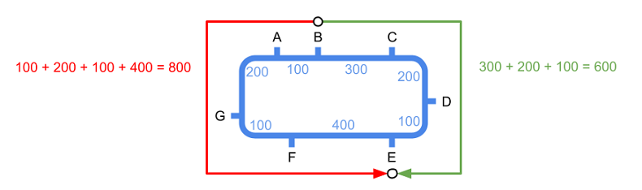
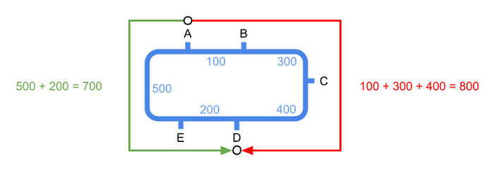
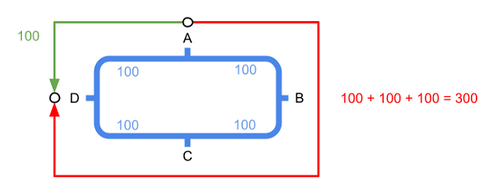
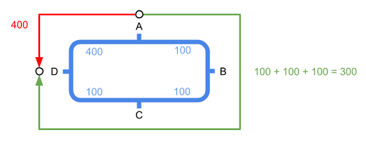
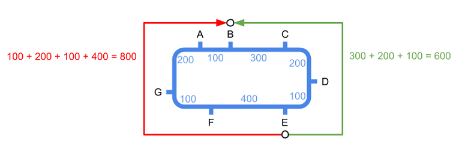
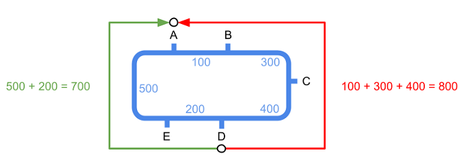
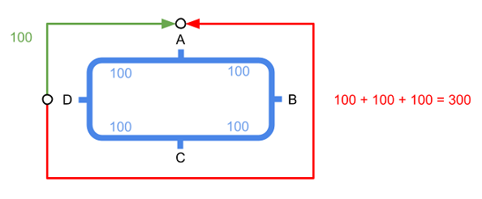
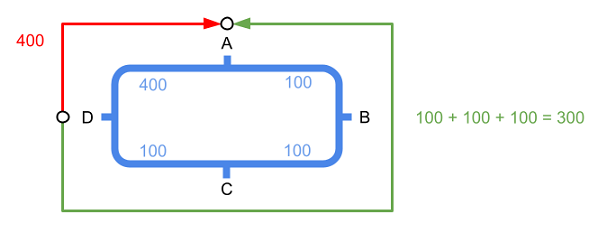

# Metro circular


Estamos desarrollando un app para planificar rutas en metro. Ya la tenemos casi lista, pero hay algunas líneas que son circulares y nos traen de cabeza.

En estas líneas de metro circulares hay trenes dando vueltas en los dos sentidos. Así que si un pasajero quiere ir de una estación A a otra estación B, puede viajar en cualquiera de los dos sentidos. Claro está que en un sentido el viaje puede ser más corto que en el otro.

Nuestra app, debe informar cuál es la ruta más corta entre las estaciones de origen y destino seleccionadas por el usuario, informando del tiempo total de viaje y de todas las paradas intermedias.

## Input

El primer número <span style="font-size: 100%; display: inline-block;" class="MathJax_SVG" id="MathJax-Element-1-Frame"><svg xmlns:xlink="http://www.w3.org/1999/xlink" width="2.064ex" height="2.176ex" style="vertical-align: -0.338ex;" viewBox="0 -791.3 888.5 936.9" role="img" focusable="false"><g stroke="currentColor" fill="currentColor" stroke-width="0" transform="matrix(1 0 0 -1 0 0)"><path stroke-width="1" d="M234 637Q231 637 226 637Q201 637 196 638T191 649Q191 676 202 682Q204 683 299 683Q376 683 387 683T401 677Q612 181 616 168L670 381Q723 592 723 606Q723 633 659 637Q635 637 635 648Q635 650 637 660Q641 676 643 679T653 683Q656 683 684 682T767 680Q817 680 843 681T873 682Q888 682 888 672Q888 650 880 642Q878 637 858 637Q787 633 769 597L620 7Q618 0 599 0Q585 0 582 2Q579 5 453 305L326 604L261 344Q196 88 196 79Q201 46 268 46H278Q284 41 284 38T282 19Q278 6 272 0H259Q228 2 151 2Q123 2 100 2T63 2T46 1Q31 1 31 10Q31 14 34 26T39 40Q41 46 62 46Q130 49 150 85Q154 91 221 362L289 634Q287 635 234 637Z"></path></g></svg></span> indica la cantidad de estaciones.

A continuación vienen los <span style="font-size: 100%; display: inline-block;" class="MathJax_SVG" id="MathJax-Element-2-Frame"><svg xmlns:xlink="http://www.w3.org/1999/xlink" width="2.064ex" height="2.176ex" style="vertical-align: -0.338ex;" viewBox="0 -791.3 888.5 936.9" role="img" focusable="false"><g stroke="currentColor" fill="currentColor" stroke-width="0" transform="matrix(1 0 0 -1 0 0)"><path stroke-width="1" d="M234 637Q231 637 226 637Q201 637 196 638T191 649Q191 676 202 682Q204 683 299 683Q376 683 387 683T401 677Q612 181 616 168L670 381Q723 592 723 606Q723 633 659 637Q635 637 635 648Q635 650 637 660Q641 676 643 679T653 683Q656 683 684 682T767 680Q817 680 843 681T873 682Q888 682 888 672Q888 650 880 642Q878 637 858 637Q787 633 769 597L620 7Q618 0 599 0Q585 0 582 2Q579 5 453 305L326 604L261 344Q196 88 196 79Q201 46 268 46H278Q284 41 284 38T282 19Q278 6 272 0H259Q228 2 151 2Q123 2 100 2T63 2T46 1Q31 1 31 10Q31 14 34 26T39 40Q41 46 62 46Q130 49 150 85Q154 91 221 362L289 634Q287 635 234 637Z"></path></g></svg></span> nombres de cada estación (una palabra)

A continuación vienen los <span style="font-size: 100%; display: inline-block;" class="MathJax_SVG" id="MathJax-Element-3-Frame"><svg xmlns:xlink="http://www.w3.org/1999/xlink" width="2.064ex" height="2.176ex" style="vertical-align: -0.338ex;" viewBox="0 -791.3 888.5 936.9" role="img" focusable="false"><g stroke="currentColor" fill="currentColor" stroke-width="0" transform="matrix(1 0 0 -1 0 0)"><path stroke-width="1" d="M234 637Q231 637 226 637Q201 637 196 638T191 649Q191 676 202 682Q204 683 299 683Q376 683 387 683T401 677Q612 181 616 168L670 381Q723 592 723 606Q723 633 659 637Q635 637 635 648Q635 650 637 660Q641 676 643 679T653 683Q656 683 684 682T767 680Q817 680 843 681T873 682Q888 682 888 672Q888 650 880 642Q878 637 858 637Q787 633 769 597L620 7Q618 0 599 0Q585 0 582 2Q579 5 453 305L326 604L261 344Q196 88 196 79Q201 46 268 46H278Q284 41 284 38T282 19Q278 6 272 0H259Q228 2 151 2Q123 2 100 2T63 2T46 1Q31 1 31 10Q31 14 34 26T39 40Q41 46 62 46Q130 49 150 85Q154 91 221 362L289 634Q287 635 234 637Z"></path></g></svg></span> tiempos de trayecto entre estaciones (en segundos):
El primer tiempo corresponde al tiempo de viaje entre la primera y la segunda estación, y así sucesivamente, de forma que el último tiempo corresponde al tiempo entre la última y la primera. Los tiempos de viajes entre las estaciones son los mismos en ambos sentidos.

Por último vienen los nombres de las estaciones de origen y destino.

## Output

Se imprimirán los nombres de las estaciones de la ruta más corta, cada una en una nueva línea.

Al final se imprimirá el tiempo total de viaje (en segundos).

## Tests

### Test
```input
7
A   B   C   D   E   F   G
100 300 200 100 400 100 200

B E
```
```output
B
C
D
E
600
```
```explanation

```

### Test
```input
5
A   B   C   D   E
100 300 400 200 500

A D
```
```output
A
E
D
700
```
```explanation

```

### Test
```input
4
A   B   C   D
100 100 100 100

A D
```
```output
A
D
100
```
```explanation

```

### Test
```input
4
A   B   C   D
100 100 100 400

A D
```
```output
A
B
C
D
300
```
```explanation

```

### Test
```input
7
A   B   C   D   E   F   G
100 300 200 100 400 100 200

E B
```
```output
E
D
C
B
600
```
```explanation

```

### Test
```input
5
A   B   C   D   E
100 300 400 200 500

D A
```
```output
D
E
A
700
```
```explanation

```

### Test
```input
4
A   B   C   D
100 100 100 100

D A
```
```output
D
A
100
```
```explanation

```

### Test
```input
4
A   B   C   D
100 100 100 400

D A
```
```output
D
C
B
A
300
```
```explanation

```

### Test
```input
10
Laguna Carpetana Oporto Usera Legazpi Arganzuela Pacifico Conde Baranda ODonell
300    400       350    220   550     430        290      190   400     100

Carpetana Pacifico
```
```output
Carpetana
Laguna
ODonell
Baranda
Conde
Pacifico
1280
```

### Test
```input
10
Laguna Carpetana Oporto Usera Legazpi Arganzuela Pacifico Conde Baranda ODonell
300    400       350    220   550     430        290      190   400     100

Pacifico Carpetana 
```
```output
Pacifico
Conde
Baranda
ODonell
Laguna
Carpetana
1280
```

### Test
```input
10
Laguna Carpetana Oporto Usera Legazpi Arganzuela Pacifico Conde Baranda ODonell
300    400       350    220   550     430        290      190   400     100

Arganzuela ODonell
```
```output
Arganzuela
Pacifico
Conde
Baranda
ODonell
1310
```

### Test private
```input
10
Laguna Carpetana Oporto Usera Legazpi Arganzuela Pacifico Conde Baranda ODonell
300    400       350    220   550     430        290      190   400     100

ODonell Arganzuela
```
```output
ODonell
Baranda
Conde
Pacifico
Arganzuela
1310
```
