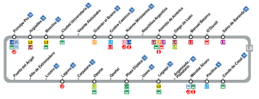

# Metro circular

Estamos desarrollando un app para planificar rutas en metro. Ya la tenemos casi lista, pero hay algunas líneas que son circulares y nos traen de cabeza.

En estas líneas de metro circulares hay trenes dando vueltas en los dos sentidos. Así que si un pasajero quiere ir de una estación A a otra estación B, puede viajar en cualquiera de los dos sentidos. Claro está que en un sentido el viaje puede ser más corto que en el otro.

Nuestra app, debe informar cuál es la ruta más corta entre las estaciones de origen y destino seleccionadas por el usuario, informando del tiempo total de viaje y de todas las paradas intermedias.

## Input

El primer número  indica la cantidad de estaciones.

A continuación vienen los  nombres de cada estación (una palabra)

A continuación vienen los  tiempos de trayecto entre estaciones (en segundos):
El primer tiempo corresponde al tiempo de viaje entre la primera y la segunda estación, y así sucesivamente, de forma que el último tiempo corresponde al tiempo entre la última y la primera. Los tiempos de viajes entre las estaciones son los mismos en ambos sentidos.

Por último vienen los nombres de las estaciones de origen y destino.

Se garantiza que los tiempos de viaje en ambos sentidos entre origen y destino son distintos.

## Output

Se imprimirán los nombres de las estaciones de la ruta más corta, cada una en una nueva línea.

Al final se imprimirá el tiempo total de viaje (en segundos).
