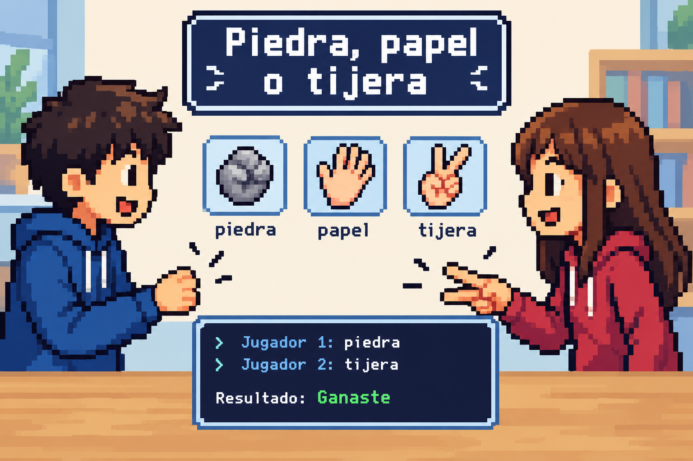

Escribe un programa que simule una partida de **piedra, papel o tijera** entre dos jugadores.

El programa debe pedir al primer jugador que elija una mano y después pedir al segundo jugador que elija su mano. Las opciones válidas son:

- `piedra`
- `papel`
- `tijera`

Después, el programa debe indicar si el primer jugador ha **ganado**, **perdido** o ha habido **empate**.

Si alguno de los jugadores escribe una opción que no sea válida, el programa debe mostrar un mensaje indicando que la mano es desconocida.

## Entrada

El programa debe leer dos cadenas de texto:

1. La mano elegida por el primer jugador.
2. La mano elegida por el segundo jugador.

Cada mano debe ser `piedra`, `papel` o `tijera`.

## Salida

Imprime una línea con el resultado de la partida:

- `Resultado: Empate` si ambos jugadores han elegido la misma mano.
- `Resultado: Ganaste` si la mano del primer jugador gana a la del segundo.
- `Resultado: Perdiste` si la mano del primer jugador pierde contra la del segundo.
- `Resultado: Mano desconocida: ¡elige piedra, papel o tijera!` si alguna de las manos no es válida.

Las reglas son las habituales:

- La piedra gana a la tijera.
- La tijera gana al papel.
- El papel gana a la piedra.