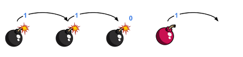
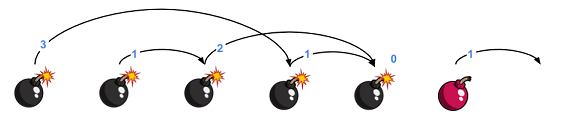
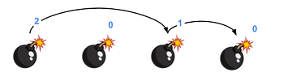
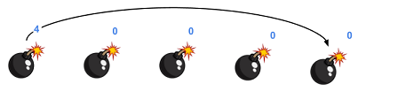
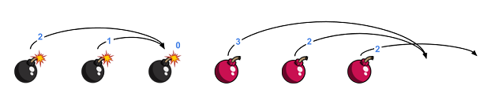
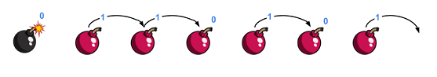
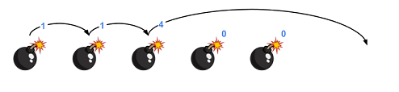
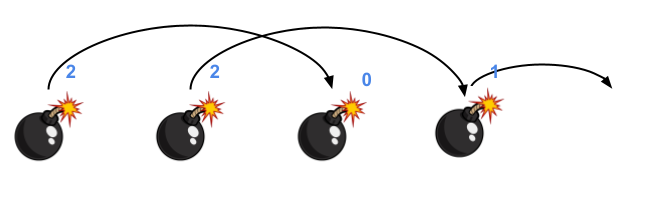

# Reacció en cadena


Hi han una sèrie de bombes col·locades en línia recta i separades per 1 metre.

Quan una bomba explota, la seva ona expansiva fa que explotin totes aquelles bombes que estiguin dintre del seu abast.

A partir de l'abast de l'ona expansiva de cada bomba, indica quina serà l'última bomba en explotar si fem explotar la primera de totes.

## Input

El primer nombre <span style="font-size: 100%; display: inline-block;" class="MathJax_SVG" id="MathJax-Element-1-Frame"><svg xmlns:xlink="http://www.w3.org/1999/xlink" width="2.064ex" height="2.176ex" style="vertical-align: -0.338ex;" viewBox="0 -791.3 888.5 936.9" role="img" focusable="false"><g stroke="currentColor" fill="currentColor" stroke-width="0" transform="matrix(1 0 0 -1 0 0)"><path stroke-width="1" d="M234 637Q231 637 226 637Q201 637 196 638T191 649Q191 676 202 682Q204 683 299 683Q376 683 387 683T401 677Q612 181 616 168L670 381Q723 592 723 606Q723 633 659 637Q635 637 635 648Q635 650 637 660Q641 676 643 679T653 683Q656 683 684 682T767 680Q817 680 843 681T873 682Q888 682 888 672Q888 650 880 642Q878 637 858 637Q787 633 769 597L620 7Q618 0 599 0Q585 0 582 2Q579 5 453 305L326 604L261 344Q196 88 196 79Q201 46 268 46H278Q284 41 284 38T282 19Q278 6 272 0H259Q228 2 151 2Q123 2 100 2T63 2T46 1Q31 1 31 10Q31 14 34 26T39 40Q41 46 62 46Q130 49 150 85Q154 91 221 362L289 634Q287 635 234 637Z"></path></g></svg></span> indica la quantitat de bombes que hi ha.

A continuació venen els <span style="font-size: 100%; display: inline-block;" class="MathJax_SVG" id="MathJax-Element-2-Frame"><svg xmlns:xlink="http://www.w3.org/1999/xlink" width="2.064ex" height="2.176ex" style="vertical-align: -0.338ex;" viewBox="0 -791.3 888.5 936.9" role="img" focusable="false"><g stroke="currentColor" fill="currentColor" stroke-width="0" transform="matrix(1 0 0 -1 0 0)"><path stroke-width="1" d="M234 637Q231 637 226 637Q201 637 196 638T191 649Q191 676 202 682Q204 683 299 683Q376 683 387 683T401 677Q612 181 616 168L670 381Q723 592 723 606Q723 633 659 637Q635 637 635 648Q635 650 637 660Q641 676 643 679T653 683Q656 683 684 682T767 680Q817 680 843 681T873 682Q888 682 888 672Q888 650 880 642Q878 637 858 637Q787 633 769 597L620 7Q618 0 599 0Q585 0 582 2Q579 5 453 305L326 604L261 344Q196 88 196 79Q201 46 268 46H278Q284 41 284 38T282 19Q278 6 272 0H259Q228 2 151 2Q123 2 100 2T63 2T46 1Q31 1 31 10Q31 14 34 26T39 40Q41 46 62 46Q130 49 150 85Q154 91 221 362L289 634Q287 635 234 637Z"></path></g></svg></span> abasts de l'ona expansiva de cada bomba.

Per exemple, els següents abasts corresponen a les següents bombes:

```
2 1 3 0 1 1
```


## Output

S'imprimirà la posició de l'última bomba en explotar (començant a comptar per 1)

## Tests

### Test
```input
4
1 1 0 1
```
```output
3
```
```explanation

```

### Test
```input
6
3 1 2 1 0 1
```
```output
5
```
```explanation

```

### Test
```input
4
2 0 1 0
```
```output
4
```
```explanation

```

### Test
```input
5
4 0 0 0 0
```
```output
5
```
```explanation

```

### Test
```input
6
2 1 0 3 2 2
```
```output
3
```
```explanation

```

### Test
```input
7
0 1 1 0 1 0 1
```
```output
1
```
```explanation

```

### Test
```input
5
1 1 4 0 0
```
```output
5
```
```explanation

```

### Test
```input
10
3 0 0 2 0 1 8 0 0 0
```
```output
10
```

### Test
```input
1
0
```
```output
1
```

### Test
```input
1
5
```
```output
1
```

### Test
```input
10
1 1 1 0 1 1 1 1 1 1
```
```output
4
```
```explanation

```

### Test
```input
4
2 2 0 1
```
```output
4
```

### Test private
```input
10
3 2 2 0 1 2 3 0 0 1 
```
```output
10
```
