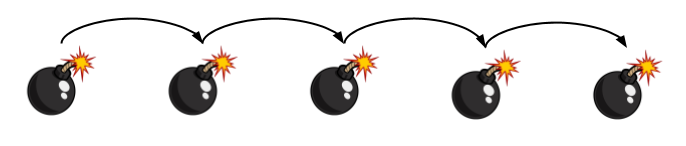
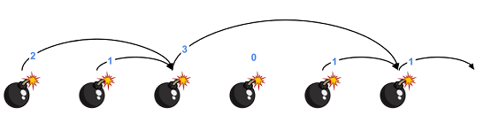

# Reacció en cadena



Hi han una sèrie de bombes col·locades en línia recta i separades per 1 metre.

Quan una bomba explota, la seva ona expansiva fa que explotin totes aquelles bombes que estiguin dintre del seu abast.

A partir de l'abast de l'ona expansiva de cada bomba, indica quina serà l'última bomba en explotar si fem explotar la primera de totes.

## Input

El primer nombre  indica la quantitat de bombes que hi ha.

A continuació venen els  abasts de l'ona expansiva de cada bomba.

Per exemple, els següents abasts corresponen a les següents bombes:

```text
2 1 3 0 1 1
```



## Output

S'imprimirà la posició de l'última bomba en explotar (començant a comptar per 1)

## Plantillas

```java
import java.util.Scanner;

public class Main {

    public static void main(String[] args) {
      	Scanner scanner = new Scanner(System.in);
      
      
    }
}
```

## Tests

### Test 7.69
```input
4
1 1 0 1
```
```output
3
```

### Test 7.69
```input
6
3 1 2 1 0 1
```
```output
5
```

### Test private 7.69
```input
4
2 0 1 0
```
```output
4
```

### Test private 7.69
```input
5
4 0 0 0 0
```
```output
5
```

### Test private 7.69
```input
6
2 1 0 3 2 2
```
```output
3
```

### Test private 7.69
```input
7
0 1 1 0 1 0 1
```
```output
1
```

### Test private 7.69
```input
5
1 1 4 0 0
```
```output
5
```

### Test private 7.69
```input
10
3 0 0 2 0 1 8 0 0 0
```
```output
10
```

### Test private 7.69
```input
1
0
```
```output
1
```

### Test private 7.69
```input
1
5
```
```output
1
```

### Test private 7.69
```input
10
1 1 1 0 1 1 1 1 1 1
```
```output
4
```

### Test private 7.69
```input
4
2 2 0 1
```
```output
4
```

### Test private 7.72
```input
10
3 2 2 0 1 2 3 0 0 1 
```
```output
10
```
