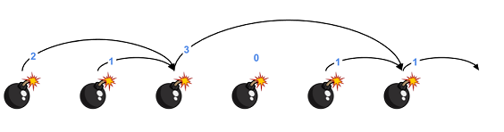

# Reacció en cadena


Hi han una sèrie de bombes col·locades en línia recta i separades per 1 metre.

Quan una bomba explota, la seva ona expansiva fa que explotin totes aquelles bombes que estiguin dintre del seu abast.

A partir de l'abast de l'ona expansiva de cada bomba, indica quina serà l'última bomba en explotar si fem explotar la primera de totes.

## Input

El primer nombre  indica la quantitat de bombes que hi ha.

A continuació venen els  abasts de l'ona expansiva de cada bomba.

Per exemple, els següents abasts corresponen a les següents bombes:

```text
2 1 3 0 1 1
```



## Output

S'imprimirà la posició de l'última bomba en explotar (començant a comptar per 1)
