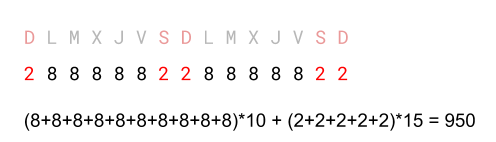
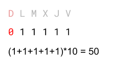
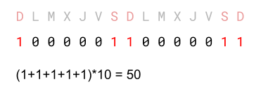
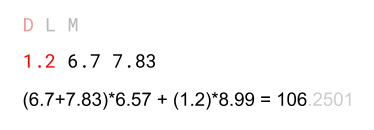

# Salari


Per a calcular el salari d'un treballador es mira la quantitat d'hores treballades i a quan es paga l'hora. 

Les hores treballades en dissabte i diumenge són "extra" i es paguen a un preu diferent.

A partir del registre d'hores treballades cada dia per un treballador i el preus per hora i per hora extra, calcula el seu salari.

## Input

El primer número <span style="font-size: 100%; display: inline-block;" class="MathJax_SVG" id="MathJax-Element-1-Frame"><svg xmlns:xlink="http://www.w3.org/1999/xlink" width="2.064ex" height="2.176ex" style="vertical-align: -0.338ex;" viewBox="0 -791.3 888.5 936.9" role="img" focusable="false"><g stroke="currentColor" fill="currentColor" stroke-width="0" transform="matrix(1 0 0 -1 0 0)"><path stroke-width="1" d="M234 637Q231 637 226 637Q201 637 196 638T191 649Q191 676 202 682Q204 683 299 683Q376 683 387 683T401 677Q612 181 616 168L670 381Q723 592 723 606Q723 633 659 637Q635 637 635 648Q635 650 637 660Q641 676 643 679T653 683Q656 683 684 682T767 680Q817 680 843 681T873 682Q888 682 888 672Q888 650 880 642Q878 637 858 637Q787 633 769 597L620 7Q618 0 599 0Q585 0 582 2Q579 5 453 305L326 604L261 344Q196 88 196 79Q201 46 268 46H278Q284 41 284 38T282 19Q278 6 272 0H259Q228 2 151 2Q123 2 100 2T63 2T46 1Q31 1 31 10Q31 14 34 26T39 40Q41 46 62 46Q130 49 150 85Q154 91 221 362L289 634Q287 635 234 637Z"></path></g></svg></span> indica la quantitat de dies enregistrats.

A continuació ve una sèrie de <span style="font-size: 100%; display: inline-block;" class="MathJax_SVG" id="MathJax-Element-2-Frame"><svg xmlns:xlink="http://www.w3.org/1999/xlink" width="2.064ex" height="2.176ex" style="vertical-align: -0.338ex;" viewBox="0 -791.3 888.5 936.9" role="img" focusable="false"><g stroke="currentColor" fill="currentColor" stroke-width="0" transform="matrix(1 0 0 -1 0 0)"><path stroke-width="1" d="M234 637Q231 637 226 637Q201 637 196 638T191 649Q191 676 202 682Q204 683 299 683Q376 683 387 683T401 677Q612 181 616 168L670 381Q723 592 723 606Q723 633 659 637Q635 637 635 648Q635 650 637 660Q641 676 643 679T653 683Q656 683 684 682T767 680Q817 680 843 681T873 682Q888 682 888 672Q888 650 880 642Q878 637 858 637Q787 633 769 597L620 7Q618 0 599 0Q585 0 582 2Q579 5 453 305L326 604L261 344Q196 88 196 79Q201 46 268 46H278Q284 41 284 38T282 19Q278 6 272 0H259Q228 2 151 2Q123 2 100 2T63 2T46 1Q31 1 31 10Q31 14 34 26T39 40Q41 46 62 46Q130 49 150 85Q154 91 221 362L289 634Q287 635 234 637Z"></path></g></svg></span> números decimals que indiquen la quantitat d'hores treballades cada dia. **El primer dia correspon a Diumenge**.

A continuació venen el preu per hora, i el preu per hora extra.

## Output

S'imprimirà el salari total, sense decimals.

## Plantillas

```java
import java.util.Locale;
import java.util.Scanner;

public class Main {

    public static void main(String[] args) {
        Scanner scanner = new Scanner(System.in);
        scanner.useLocale(Locale.ENGLISH);
		
      	
    }
}
```

## Tests

### Test
```input
15
2 8 8 8 8 8 2 2 8 8 8 8 8 2 2
10
15
```
```output
950
```
```explanation

```

### Test
```input
6
0 1 1 1 1 1
10
15
```
```output
50
```
```explanation

```

### Test
```input
15
1 0 0 0 0 0 1 1 0 0 0 0 0 1 1
5
10
```
```output
50
```
```explanation

```

### Test
```input
3
1.2 6.7 7.83
6.57
8.99
```
```output
106
```
```explanation

```

### Test
```input
30
2 6 5 3 7 6 5 4 6 7 5 6 7 4 5 8 9 4 5 4 3 5 5 4 7 6 8 5 4 7
7.27
9.87
```
```output
1273
```

### Test
```input
64
7 5 5 4 6 7 7 4 5 4 4 5 6 7 4 4 5 5 4 4 5 4 5 4 4 7 7 6 6 7 5 4 5 4 6 4 7 7 6 4 7 6 7 7 7 6 5 6 4 6 6 6 6 4 6 5 7 4 4 6 4 5 7 7 
9.99
14.99
```
```output
4011
```

### Test
```input
1
5
10
20
```
```output
100
```

### Test
```input
256
7 2 8 8 5 3 4 8 6 3 5 6 1 8 1 5 1 0 4 0 6 8 2 0 2 5 2 5 3 2 4 8 4 8 2 0 6 0 3 1 7 0 7 8 4 2 3 7 6 4 7 8 8 2 1 4 5 0 2 0 3 0 1 3 5 3 6 0 0 5 6 1 0 6 6 4 6 7 5 2 1 7 1 7 5 4 2 5 6 6 1 4 4 6 0 0 4 1 5 1 3 6 1 7 0 5 0 8 6 2 7 2 7 6 2 4 2 6 1 4 6 5 3 2 6 0 4 7 0 0 3 0 7 1 2 0 2 5 8 7 0 8 3 0 8 2 6 8 3 5 2 7 8 6 5 1 0 6 5 4 3 5 5 3 6 1 2 4 2 6 7 8 7 3 7 5 7 4 8 5 0 6 1 7 8 5 5 2 8 4 5 6 2 6 3 4 0 1 6 5 4 6 3 8 0 6 3 5 4 0 0 2 8 6 3 6 5 4 5 3 7 1 7 1 8 6 3 6 2 0 8 2 2 0 6 0 8 3 1 7 7 2 7 4 3 8 4 3 6 4 0 5 5 6 7 0 
12.49
17.69
```
```output
14400
```

### Test private
```input
2
1 1
1
1
```
```output
2
```
