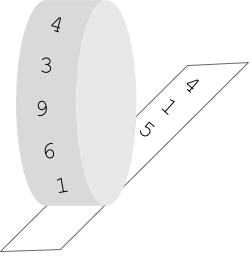

# Parin les rotatives!

A la redacció del periòdic arriba una notícia molt important... parin les rotatives!!

La màquina rotativa del periòdic és així:



En un rodet està el text que es va a imprimir. Aleshores el rodet comença a rodar i el paper va corrent per sota.

## Input

El primer número  indica el tamany de la seqüència. A continuació ve la seqüència de números a imprimir.

Després ve la quantitat de números  que s'havien imprés en el moment en que es para la rotativa.

## Output

La seqüència de números impresos separada per espais.

## Tests

### Test 14.29
```input
3    1 2 3
3
```
```output
1 2 3
```

### Test 14.29
```input
3    100 200 300
5
```
```output
100 200 300 100 200
```

### Test private 14.29
```input
3    100 200 300
7
```
```output
100 200 300 100 200 300 100
```

### Test private 14.29
```input
3    100 200 300
2
```
```output
100 200
```

### Test private 14.29
```input
5    100 200 300 400 500
4
```
```output
100 200 300 400
```

### Test private 14.29
```input
3    10 20 30
10
```
```output
10 20 30 10 20 30 10 20 30 10
```

### Test private 14.26
```input
3    1 2 3
20
```
```output
1 2 3 1 2 3 1 2 3 1 2 3 1 2 3 1 2 3 1 2
```
