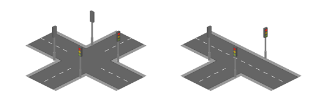

# Simcity

Los **Tilemaps** son una técnica popular en el desarrollo de juegos 2D, que consiste en construir el mundo del juego a partir de pequeñas imagenes regulares llamadas *tiles*.

Estamos desarrollando un juego de simulación de ciudades isométrico. Ya tenemos listo el desarrollo de las carreteras. El mapa del juego está representado internamente por una matriz de caracteres. Cada caracter corresponde a un *tile* del mapa. Los tiles donde hay carretera corresponden al caracter `#`, y en los que hay hierba, el caracter `.`

Por ejemplo el siguiente mapa se representa con la siguiente matriz:

Para hacer más atractivo el juego queremos añadir los semáforos en las intersecciones. Emepezaremos contando el número de semáforos que serán necesarios.

Necesitaremos 3 semáforos en aquellas intersecciones donde se crucen 3 carreteras, y 4 en los cruces de 4 carreteras:

## Input

En primer lugar, los números  y  indican el ancho y alto del mapa, respectivamente.

A continuación vienen los x *tiles* del mapa (`#` `.`). Los *tiles* están separados por espacios en blanco y saltos de línea.

## Output

Un entero indicando la cantidad de semáforos necesaria
