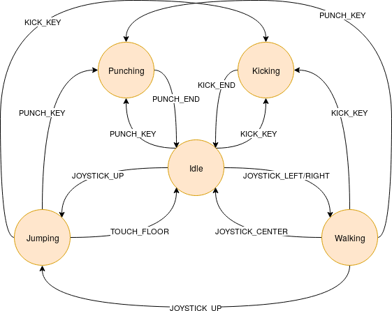

# Street Fighter

En la majoria de jocs, per a modelar el comportament dels personatges s'utilitza una **màquina d'estats**.

La màquina d'estats defineix les possibles accions que pot estar realitzant un personatge, i els events que inicien les accions. Per exemple, un jugador pot estar en estat "CAMINANT" i quan es produeix l'event en què l'usuari "POLSA LA TECLA DE DISPAR", aleshores canvia l'acció i passa a estar en estat "DISPARANT".

La cosa es complica una mica perquè hi ha estats als quals no es pot arribar partint d'altres. Per exemple, hi ha jocs en els que el personatge no pot disparar mentre esta saltant. En aquest cas no seria possible la transició directa entre l'estat "SALTANT" i l'estat "DISPARANT"·

Es demana implementar una màquina d'estats bàsica per a un personatge del joc Street Fighter:

Els **estats** possibles d'un personatge són:

Els **events** que poden canviar l'estat d'un personatge són:

- JOYSTICK_UP: El jugador ha accionat el joystick cap amunt

- JOYSTICK_LEFT/RIGHT: El jugador ha accionat el joystick a esquerra o dreta

- JOYSTICK_CENTER: El jugador a deixat el joystick al centre

- PUNCH_KEY: El jugador a polsat el botó de cop de puny

- KICK_KEY: El jugador a polsat el botó de cop de peu

- PUNCH_END: L'acció de cop de puny ha acabat

- KICK_END: L'acció de cop de peu ha acabat

- TOUCH_FLOOR: El personatge ha tocat terra

El següent diagrama ilustra les transicions entre estats que provoquen aquests events.

## Input

L'entrada consta de dues paraules:

- L'estat actual del personatge: {"IDLE", "WALK", "JUMP", "KICK", "PUNCH"}

- L'event que ha ocorregut: {"JOYSTICK_UP", "JOYSTICK_LEFT/RIGHT", "JOYSTICK_CENTER", "PUNCH_KEY", "KICK_KEY", "PUNCH_END", "KICK_END", "TOUCH_FLOOR"}

No hi ha

## Output

S'imprimirà l'estat en el qual quedarà el personatge.

Si l'event ocorregut no modifica l'estat, es mostrarà el que tenia abans de l'event.
