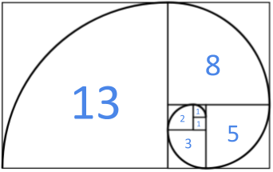

# Successions de Fibonacci

La successió de Fibonacci comença amb els nombres 0 i 1, i a partir d'aquests, «cada terme és la suma dels dos anteriors».



A partir de vàries sequències de nombres, determina si són successions de Fibonacci.

## Input

El primer nombre  indica la quantitat de seqüències que venen després.

Cada sequència de N nombres acaba amb un -1.

Cada seqüència té almenys 2 números.

## Output

Un "SI" o un "NO" per cada seqüència; separats per un salt de línia.

## Tests

### Test
```input
2
1 1 2 3    -1
0 1 1    -1
```
```output
NO
SI
```

### Test
```input
2
0 1 1 2 3 5    -1
0 1 1 5    -1
```
```output
SI
NO
```

### Test
```input
2
1 1 2 3 5    -1
0 1    -1
```
```output
NO
SI
```

### Test
```input
1
0 1 1 2 3    -1
```
```output
SI
```

### Test
```input
4
0 0 1 1 2 3 5    -1
0 1 2 3 5 8    -1
0 1 1 2 3 5 13    -1
0 1 1 2 3 5 8 13 21 34 55    -1
```
```output
NO
NO
NO
SI
```
