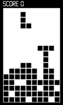
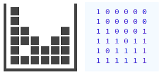

# Tetris, eliminar línies



Al Tetris, quan una línia horitzontal es completa, aquesta línia desapareix i totes les peces que estan a sobre descendeixen una posició.

Donat un tauler de Tetris, imprimeix el tauler resultant d'eliminar les línies completades.

## Input

Primer s'indica el número de  i  del tauler.

A continuació venen una sèrie de `1` i `0` que indiquen l'estat de cada casella. `1` significa ocupada i `0` significa lliure.

Per exemple, aquest tauler de Tetris es podria representar així:



## Output

S'imprimirà el tauler resultant amb el mateix format que a l'entrada.

## Plantillas

```java
import java.util.Scanner;

public class Main {

    public static void main(String[] args) {
        Scanner scanner = new Scanner(System.in);
      	
      	
    }
}
```

## Tests

### Test
```input
3 4
1 1 0 1
1 0 0 1
1 1 1 1
```
```output
1 1 0 1
1 0 0 1
```

### Test
```input
5 4
1 0 0 1
1 1 1 1
1 0 1 1
1 1 0 0
0 1 1 1
```
```output
1 0 0 1
1 0 1 1
1 1 0 0
0 1 1 1
```

### Test
```input
6 4
1 0 0 0
1 1 0 0
1 1 1 1
1 1 1 1
0 1 1 1
1 1 1 1
```
```output
1 0 0 0
1 1 0 0
0 1 1 1
```

### Test
```input
8 5
0 0 0 0 0
0 0 0 0 0
1 0 0 0 1
1 1 0 0 1
1 1 1 1 1
1 1 1 1 1
0 1 1 1 1
1 1 1 1 0
```
```output
0 0 0 0 0
0 0 0 0 0
1 0 0 0 1
1 1 0 0 1
0 1 1 1 1
1 1 1 1 0
```

### Test
```input
3 4
1 1 1 1
1 1 1 1
1 1 1 1
```
```output
```
