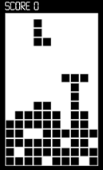

# Tetris, eliminar línies

Al Tetris, quan una línia horitzontal es completa, aquesta línia desapareix i totes les peces que estan a sobre descendeixen una posició.

Donat un tauler de Tetris, imprimeix el tauler resultant d'eliminar les línies completades.

## Input

Primer s'indica el número de  i  del tauler.

A continuació venen una sèrie de `1` i `0` que indiquen l'estat de cada casella. `1` significa ocupada i `0` significa lliure.

Per exemple, aquest tauler de Tetris es podria representar així:

## Output

S'imprimirà el tauler resultant amb el mateix format que a l'entrada.
