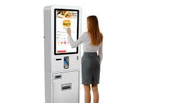

# TPV



Estamos desarrollando una aplicación para un Terminal de Punto de Venta de un restaurante de comida rápida.

El cliente va seleccionando los productos que desea pedir y el terminal le muestra el precio total del pedido.

## Input

En primer lugar se indican los datos de la carta de productos:

- El primer número  indica la cantidad de productos disponibles en la carta.

- A continuación vienen los  nombres de cada producto (una palabra)

- A continuación vienen los  precios de cada producto (float)

Luego vienen los datos del pedido:

- El primer número  indica la cantidad de líneas que hay en el pedido

- Por cada línea se indica, el nombre del producto y la cantidad de unidades pedidas

En el pedido puede haber productos repetidos en distintas líneas.

## Output

Se imprimirá el precio total del pedido en formato float.

## Plantillas

```java
import java.util.Locale;
import java.util.Scanner;

public class Main {

    public static void main(String[] args) {
        Scanner scanner = new Scanner(System.in);
        scanner.useLocale(Locale.ENGLISH);
      	
      	
    }
}
```

## Tests

### Test
```input
5
Hamburguesa Refresco Patatas Ensalada Tarta
4           1        2       3        5

3
Hamburguesa 2
Refresco 2
Tarta 1
```
```output
15.0
```

### Test
```input
3
Pizza Frankfurt Sandwich
4     2.5       1.25   

2
Pizza 3
Frankfurt 2
```
```output
17.0
```

### Test
```input
6
Pizza Burguer Hotdog Chips Kebab Burrito
4.25  3.75    2.25   0.75  3.5   3.5

4
Pizza 2
Burguer 2
Hotdog 3
Burrito 1
```
```output
26.25
```

### Test
```input
3
Hamburguesa Patatas Bebida
3           2       1

5
Hamburguesa 2
Patatas 1
Hamburguesa 1
Bebida 2
Patatas 2
```
```output
17.0
```
