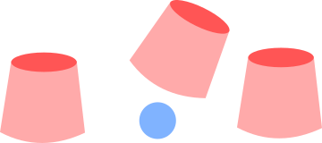

# Triler

L'objectiu del joc de triler és que la víctima endevini sota quin dels 3 gobelets es troba la boleta. Els gobelets son manejats per l'estafador, canviant-los de posició i movent la boleta d'un a l'atre.

Els moviments del triler tracten de despistar la víctima, però al cap i a la fi cada moviment es resumeix en: "**Moure la bola a l'esquerra o a la dreta**".

Representarem l'estat del joc amb un "*" per al gobelet que té la bola, i amb "_" els gobelets que no tenen bola.

**El joc comença amb la bola al primer gobelet** (* _ _ *). Aleshores, si el triler fa dos moviments cap a la dreta, per exemple, la bola acabará en el tercer gobelet (* _ _ *).

Els moviments són "circulars", és a dir, si la bola està per exemple al primer gobelet (* _ _ *) i es fa un moviment a l'esquerra, la bola passa al tercer gobelet (* _ _ *).

## Input

L'entrada consta de quatre lletres "L" o "R" (separades per espais en blanc) que indiquen els moviments que fa l'estafador.

Sempre es realitzen 4 moviments

## Output

S'imprimirà l'estat final dels gobelets, amb un asterisc per al gobelet on queda la bola, i un guió baix per als gobelets que no la tenen.
